 # 📚 KKYDP: KAPSAMLI PROJE ÖZETİ

## 🎯 Proje Vizyonu

**Kırsal Kalkınma Yatırımlarının Desteklenmesi Programı (KKYDP)**, Türkiye'nin kırsal kesiminde faaliyet gösteren çiftçi ve girişimcilere devlet hibesi sağlayarak tarımsal üretimi artırmayı, verimliliği yükseltmeyi ve kırsal ekonomiyi güçlendirmeyi hedefleyen ulusal bir dijital dönüşüm projesidir.

### Misyon
Hibe başvurusundan ödemeye kadar tüm süreci %100 dijital, şeffaf, hızlı ve adil bir şekilde yönetmek.

### Vizyon
2025 yılı sonuna kadar 100.000+ başvuruyu yönetebilen, %95+ kullanıcı memnuniyetine sahip, Türkiye'nin en başarılı e-devlet hizmetlerinden biri olmak.

---

## 🌍 İş Problemi ve Çözüm

### Mevcut Durum (AS-IS)

**Başvuran (Çiftçi) Perspektifi:**
- Hibe almak için illere fiziksel başvuru yapılıyor
- Formlar karmaşık ve anlaşılması zor
- Süreç takibi imkansız: "Başvurum ne durumda?" sorusu yanıtsız kalıyor
- Evrak eksikliği nedeniyle süreç uzuyor
- Ödeme ne zaman gelecek belirsiz

**İl Müdürlüğü Perspektifi:**
- Günde 100+ başvuru fiziksel dosya olarak geliyor
- Manuel puanlama Excel'de yapılıyor, hata riski yüksek
- Döküman doğrulama zahmetli (MERNİS, TAKBİS, ÇKS sorgulamaları ayrı ayrı)
- Saha ziyaretleri verimsiz planlanıyor
- Raporlama merkeze manuel yapılıyor

**Merkez (GMY) Perspektifi:**
- İllerden gelen değerlendirmeler tutarsız olabiliyor
- Bütçe kontrolü gerçek zamanlı değil
- Risk analizi yapılamıyor
- Bakanlığa rapor hazırlamak günler alıyor
- İller arası performans karşılaştırması yok

**Hakediş ve Ödeme:**
- Hakediş talebi fiziksel dökümanlarla yapılıyor
- Fatura kontrolü manuel, sahte belge riski var
- Saha kontrolü verimsiz, fotoğraflar kaybolabiliyor
- Banka ödeme süreci uzun (30+ gün)
- Ödeme takibi yok

### Hedef Durum (TO-BE)

**Dijital Ekosistem:**
```
[Vatandaş Web/Mobil]
        ↓
[E-Devlet Entegrasyonu] → [Akıllı Form Sistemi] → [Otomatik Kontroller]
        ↓
[İl Müdürlüğü Portal] → [AI Destekli Değerlendirme] → [Mobil Saha Uygulaması]
        ↓
[Merkez Onay Sistemi] → [Bütçe Yönetimi] → [Risk Analizi]
        ↓
[Dijital Hakediş] → [AI Fotoğraf Analizi] → [Banka Entegrasyonu] → [Anlık Ödeme]
        ↓
[Gerçek Zamanlı Dashboard & Raporlama]
```

**Temel İyileştirmeler:**
- ✅ %100 online başvuru - fiziksel döküman yok
- ✅ Ortalama süreç süresi: 45 gün → 15 gün (%67 azalma)
- ✅ Otomatik e-devlet entegrasyonları (MERNİS, TAKBİS, ÇKS, VEDOP)
- ✅ AI destekli risk skorlama
- ✅ Mobil saha uygulaması (offline çalışma)
- ✅ Gerçek zamanlı bütçe takibi
- ✅ Otomatik banka ödemesi
- ✅ 7/24 başvuru takibi

---

## 🏗️ Sistem Mimarisi - 7 Temel Modül

### 1. ETAP YÖNETİMİ SİSTEMİ (Kalp - Core Innovation)

**Ne İşe Yarar?**
Farklı hibe programları için (sera, arıcılık, hayvancılık, vs.) her birinin kendine özel formlarını, kriterlerini, bütçesini ve iş akışını sistem kodu yazmadan dinamik olarak oluşturmayı sağlar.

**Neden Kritik?**
- Her yeni hibe programı için kod yazmaya gerek kalmaz
- Merkez program koordinatörü web arayüzünden 30 dakikada yeni etap oluşturabilir
- %90 geliştirme maliyeti tasarrufu

**Ana Özellikler:**
- **10 Adımlı Sihirbaz**: Temel Bilgiler → Süre & Bütçe → Form Tasarımı → Döküman Tanımlama → Değerlendirme Kriterleri → Puanlama → Etaplar → Bütçe Dağılımı → Bildirimler → Onay
- **Drag-Drop Form Builder**: Alan ekle, sürükle, sırala
- **Dinamik Validasyon**: Her alana özel kurallar
- **Bütçe Formülü Motoru**: İl bazlı otomatik dağıtım
- **Otomatik Puanlama**: Kriter ağırlıklandırma
- **Versiyon Kontrolü**: Etap değişikliklerini izleme

**İş Akışı:**
```
Merkez Koordinatör → Sihirbaz Başlat
  → 10 Adımı Tamamla
  → GMY Onayına Gönder
  → GMY Onaylar
  → Sistem Otomatik Deploy Eder
  → İller Yeni Etabı Görür
  → Vatandaşlar Başvuru Yapabilir
```

**Örnek Kullanım:**
```
Etap: "2025 Seracılık Desteği"
Bütçe: 500M₺
Form: 45 alan (kişisel bilgi, arazi, proje, finansman)
Dökümanlar: 12 zorunlu (tapu, kimlik, vs.)
Değerlendirme: 5 kriter (teknik, finansal, sosyal, çevresel, risk)
Puanlama: 100 üzerinden, minimum 60 puan
İl Dağılımı: Nüfus %40 + Alan %30 + Öncelik %30
```

---

### 2. VATANDAŞ BAŞVURU SİSTEMİ

**Ne İşe Yarar?**
Çiftçi ve girişimcilerin evden bilgisayar/telefon ile hibe başvurusu yapmasını, döküman yüklemesini ve süreci takip etmesini sağlar.

**Kullanıcı Deneyimi:**

**Adım 1: E-Devlet Girişi**
```
[E-Devlet] → TC Kimlik Doğrulama → Sistem Girişi
→ Otomatik MERNİS Sorgusu (Ad, Soyad, Adres)
→ Otomatik ÇKS Sorgusu (Çiftçi kaydı var mı?)
→ Otomatik TAKBİS Sorgusu (Arazi bilgileri)
```

**Adım 2: Etap Seçimi**
```
Aktif Etaplar Listelenir:
- 2025 Seracılık Desteği (Başvuru: 01.01-31.03)
- 2025 Hayvancılık Desteği (Başvuru: 15.02-30.04)
- 2025 Arıcılık Desteği (Başvuru: 01.03-31.05)

Kullanıcı Seçer → Etap Detayları Gösterilir
```

**Adım 3: Form Doldurma**
```
Dinamik Form (Etap tanımından gelir):
├─ Kişisel Bilgiler (Otomatik dolu, düzenlenebilir)
├─ Arazi Bilgileri (TAKBİS'ten gelir)
├─ Proje Detayları (Manuel giriş, yardım metinleri var)
├─ Finansman Planı (Otomatik hesaplamalar)
└─ Ek Bilgiler

Her alanda:
- Yardım metni (❓ ikonu)
- Gerçek zamanlı validasyon
- Hata mesajları Türkçe ve anlaşılır
```

**Adım 4: Döküman Yükleme**
```
Zorunlu Dökümanlar (Etap tanımından):
✅ TC Kimlik Fotokopisi (Yüklendi ✓)
✅ Tapu Belgesi (Yüklendi ✓)
⚠️ İmza Sirküleri (Eksik - Yükle)
❌ Proje Raporu (Eksik - Yükle)

Döküman yükleme:
- Drag-drop arayüz
- Çoklu dosya (max 20MB)
- PDF, JPG, PNG desteklenir
- Otomatik OCR okuma (kimlik, tapu)
```

**Adım 5: Önizleme ve Gönderim**
```
Başvuru Özeti:
- Tüm girilen bilgiler
- Yüklenen dökümanlar
- Otomatik hesaplanan tutar

[Taslak Kaydet] [Geri Dön] [Gönder]

Gönder butonu:
→ Son validasyon
→ E-imza (opsiyonel)
→ Başvuru numarası (örn: ANK-2025-12345)
→ SMS + Email onayı
```

**Adım 6: Takip**
```
Başvuru Durumu Dashboard:
┌─────────────────────────────────┐
│ Başvuru No: ANK-2025-12345      │
│ Durum: İl Değerlendirmesinde    │
│ İlerleme: ████████░░░░ %60      │
├─────────────────────────────────┤
│ Timeline:                       │
│ ✅ Başvuru Alındı (10.01.2025)  │
│ ✅ Ön Kontrol Geçti (12.01.2025)│
│ 🔄 İl Değerlendirmesi (Devam)   │
│ ⏳ Merkez Onayı (Bekleniyor)    │
│ ⏳ Sözleşme (Bekleniyor)        │
└─────────────────────────────────┘
```

---

### 3. İL MÜDÜRLÜĞÜ DEĞERLENDİRME SİSTEMİ

**Ne İşe Yarar?**
İl müdürlüğü uzmanlarının başvuruları değerlendirmesini, puanlamasını, saha ziyareti planlamasını ve karar vermesini sağlar.

**Akıllı Başvuru Atama Algoritması:**
```python
# Pseudo-kod
for her_uzman in aktif_uzmanlar:
    iş_yükü_skoru = (15 - uzman.aktif_dosya_sayısı) / 15 * 40
    uzmanlık_skoru = uzman.sektör_uyumu(başvuru.sektör) * 30
    performans_skoru = uzman.geçmiş_başarı_oranı * 20
    lokasyon_skoru = (50 - mesafe_km(uzman, başvuru)) / 50 * 10

    toplam_skor = (iş_yükü + uzmanlık + performans + lokasyon)

en_uygun_uzman = max(uzmanlar, key=lambda u: u.toplam_skor)
başvuru.ata(en_uygun_uzman)
```

**Değerlendirme Süreci:**

**1. Ön Kontrol (2 gün içinde):**
```
Otomatik Kontroller:
✅ Zorunlu dökümanlar tam mı?
✅ Form verileri eksiksiz mi?
✅ Uygunluk kriterleri sağlanıyor mu?
✅ MERNİS/TAKBİS/ÇKS verileri tutarlı mı?

Sonuç:
- Uygun → Detaylı İncelemeye Geç
- Uygun Değil → Ön Red (5 gün içinde tamamlama hakkı)
- Şüpheli → Manuel İnceleme
```

**2. Detaylı İnceleme ve Puanlama (3 gün içinde):**
```
Dinamik Puanlama Formu (Etap kriterlerinden gelir):

Teknik Fizibilite (30 puan):
├─ Teknik uygunluk [0-10]: ___ puan
├─ Uygulama planı [0-10]: ___ puan
└─ Yenilikçilik [0-10]: ___ puan

Finansal Fizibilite (25 puan):
├─ Bütçe gerçekçiliği [0-10]: ___ puan
├─ Geri ödeme planı [0-10]: ___ puan
└─ Kârlılık [0-5]: ___ puan

Sosyal Etki (20 puan):
├─ İstihdam [0-10]: ___ puan
└─ Bölgesel kalkınma [0-10]: ___ puan

Çevresel Etki (15 puan):
└─ Sürdürülebilirlik [0-15]: ___ puan

Risk Değerlendirmesi (10 puan):
└─ Risk seviyesi [0-10]: ___ puan

TOPLAM: ___ / 100
Minimum Geçme Puanı: 60
```

**3. Risk Analizi:**
```
AI Risk Skoru (Otomatik):
├─ Başvuranın geçmişi (daha önce hibe aldı mı?)
├─ Finansal tutarlılık (gelir-gider dengesi)
├─ Döküman doğruluk skoru (OCR güvenilirliği)
├─ Sektör başarı oranı (bu sektörde genel başarı)
└─ Coğrafi risk (bölgesel faktörler)

Risk Skoru: 0-100
- 0-30: Düşük Risk (Yeşil) → Hızlı Onay
- 31-60: Orta Risk (Sarı) → Standart İnceleme
- 61-100: Yüksek Risk (Kırmızı) → Saha Ziyareti Zorunlu + Müdür Onayı
```

**4. Karar:**
```
Uzman Kararı:
[ ] Onayla (İl Müdürü Onayına Gönder)
[ ] Reddet (Gerekçe zorunlu)
[ ] Ek Belge İste (5 gün süre ver)
[ ] Saha Ziyareti Planla

Onaylanırsa → İl Müdürü Onayı → Merkez Onayına Gönderilir
```

---

### 4. SAHA ZİYARETİ MOBİL UYGULAMA

**Ne İşe Yarar?**
Saha uzmanlarının kırsal alanda internet olmadan değerlendirme yapmasını, fotoğraf çekmesini, GPS ile konum doğrulamasını ve anlık rapor yazmasını sağlar.

**Mobil App Özellikleri:**

**Offline Çalışma:**
```
Sabah Ofiste:
- Uygulama aç
- İnternet varsa → Günlük ziyaretleri senkronize et
- Veriler cihaza indirilir

Sahada (İnternetsiz):
- Tüm veriler offline çalışır
- Formlar doldurulur
- Fotoğraflar çekilir (cihazda saklanır)
- GPS konumu kaydedilir

Akşam Ofiste:
- İnternet bağlanınca → Otomatik senkronizasyon
- Tüm veri merkeze yüklenir
```

**GPS Doğrulama:**
```
Ziyaret Başlatma:
1. "Ziyareti Başlat" butonu
2. GPS konumunu al
3. Başvuranın adresi ile karşılaştır
4. Mesafe kontrolü:
   - 500m içinde → Onaylandı ✅
   - 500m dışında → Uyarı: "Lokasyondan uzaksınız. Devam etmek istiyor musunuz?"
5. Konum + Timestamp kaydet
6. Background tracking: Ziyaret süresi boyunca konum geçmişi

Sonuç:
- Sahte ziyaret yapılamaz
- Konum kanıtı otomatik kaydedilir
- Ziyaret süresi otomatik hesaplanır
```

**Dinamik Form (Offline):**
```
Form Etap Tanımından Gelir:
[Seracılık Saha Değerlendirme Formu]

Serra Boyutları:
En: [___] m (Sayısal, zorunlu)
Boy: [___] m (Sayısal, zorunlu)
Yükseklik: [___] m (Sayısal, zorunlu)

Sera Tipi:
( ) Cam Sera
( ) Plastik Sera
(•) Polikarbon Sera

Sulama Sistemi:
[✓] Damla Sulama
[✓] Sprink Sulama
[ ] Manuel Sulama

Ilerleme Durumu:
[████████████░░░░░░░░] %60 Tamamlanmış

Fotoğraf Ekle: [📷 10/20]
Ses Notu Ekle: [🎤 2 kayıt]

Çiftçi İmzası: [✍️ İmza Al]
Uzman Değerlendirmesi: [Devam Et →]
```

**Fotoğraf ve Metadata:**
```
Fotoğraf Çekildiğinde Otomatik Kaydedilir:
{
  "dosya_adı": "IMG_2025_01_15_143022_SERA.jpg",
  "gps_konum": "39.9334, 32.8597",
  "timestamp": "2025-01-15 14:30:22",
  "etiket": "Sera Dış Görünüm",
  "başvuru_no": "ANK-2025-12345",
  "uzman": "Ahmet Yılmaz"
}

20 fotoğraf + 3 video (max 2dk) limiti
Önce-Sonra karşılaştırması için etiketleme
```

**E-İmza (Çiftçi + Uzman):**
```
Çiftçi İmzası:
┌─────────────────────────────┐
│ BEYAN:                      │
│ Saha ziyareti gerçekleşti.  │
│ Verilen bilgiler doğrudur.  │
│                             │
│ TC Kimlik: 12345678901      │
│                             │
│ İmza:                       │
│   [Parmakla Çiz]            │
│        /Ahmet/              │
│                             │
│ Tarih: 15.01.2025 14:45     │
└─────────────────────────────┘

Uzman İmzası:
└─ Aynı şekilde uzman da imzalar
```

**Rota Optimizasyonu:**
```
Bugünün Ziyaretleri (Haritada):
📍 Çiftçi 1 - Ayaş (25 km) - 09:00
📍 Çiftçi 2 - Ayaş (3 km) - 10:30
📍 Çiftçi 3 - Beypazarı (18 km) - 12:00
📍 Çiftçi 4 - Nallıhan (45 km) - 14:00

[Rota Optimizasyonu Yap] butonu:
→ En kısa rotayı hesaplar
→ Tahmini varış saatlerini günceller
→ Google Maps entegrasyonu
→ "Navigasyonu Başlat" butonu
```

---

### 5. MERKEZ ONAY VE KOORDİNASYON

**Ne İşe Yarar?**
Merkez personelinin il onaylarını toplu değerlendirmesini, ulusal politikaya uyumu kontrol etmesini, bütçe yönetimini ve nihai onayı vermesini sağlar.

**Otomatik Ön Kontrol (Merkez):**
```
İlden Gelen Başvuru → Otomatik Kontroller:

1. Bütçe Limiti:
   ✅ Ulusal bütçe: 485M / 500M (Müsait: 15M)
   ✅ İl bütçe limiti: Ankara 50M (Kullanılan: 48M, Kalan: 2M)
   ✅ Talep tutarı: 150.000₺ (Limit içinde ✓)

2. Politika Parametreleri:
   ✅ Minimum puan: 60 (Başvuru puanı: 78 ✓)
   ✅ Sektör önceliği: Seracılık (Öncelikli ✓)
   ✅ Bölge kısıtı: Yok
   ✅ Başvuran limiti: Kişi başı max 1 aktif başvuru (0 aktif ✓)

3. Puanlama Tutarlılığı:
   ⚠️ İl puanı (78) vs Benzer başvurular (ortalama: 65)
   → %20 yüksek → Manuel inceleme önerilir

4. Döküman Eksiksizliği:
   ✅ Tüm zorunlu dökümanlar yüklü
   ✅ Saha raporu mevcut
   ✅ İl müdürü onayı mevcut

Sonuç:
- Tüm kontroller GEÇTI → Hızlı Onay Yolu
- Uyarı var → Manuel İnceleme
- Hata var → Otomatik Red
```

**İller Arası Karşılaştırma:**
```
Karşılaştırma Tablosu:
┌──────────────┬─────────┬─────────┬─────────┐
│ Başvuru      │ Ankara  │ İzmir   │ Konya   │
├──────────────┼─────────┼─────────┼─────────┤
│ Sektör       │ Sera    │ Sera    │ Sera    │
│ Talep Tutar  │ 150K₺   │ 145K₺   │ 160K₺   │
│ İl Puanı     │ 78 ⚠️   │ 65      │ 68      │
│ Risk Skoru   │ 25 (D)  │ 30 (D)  │ 28 (D)  │
│ Arazi (m²)   │ 5000    │ 4800    │ 5200    │
│ Benzerlik    │ %92     │ %88     │ %95     │
└──────────────┴─────────┴─────────┴─────────┘

Analiz:
- Ankara başvurusu benzerlerine göre %20 yüksek puanlı
- Diğer kriterler normal aralıkta
- Öneri: Manuel inceleme
```

**Bütçe Dashboard (GMY):**
```
┌─────────────────────────────────────────┐
│ ULUSAL BÜTÇE DURUMU                     │
├─────────────────────────────────────────┤
│ Toplam: 500M₺                           │
│ Kullanılan: 485M₺ [████████████████░] %97│
│ Rezerve: 12M₺                           │
│ Kalan: 3M₺ ⚠️                           │
├─────────────────────────────────────────┤
│ ⚠️ UYARI: Bütçe %97 dolu!              │
│ Mevcut hızla 5 gün içinde tükenecek!    │
├─────────────────────────────────────────┤
│ İL BAZLI DAĞILIM:                       │
│ Ankara: 48M / 50M (%96)                 │
│ İstanbul: 75M / 80M (%94)               │
│ İzmir: 42M / 45M (%93)                  │
│ Konya: 38M / 40M (%95)                  │
│ Antalya: 35M / 38M (%92)                │
└─────────────────────────────────────────┘
```

**Merkez Onay Akışı:**
```
Tutar < 200.000₺:
  İl Onayı → Merkez Uzmanı Onayı → Sözleşme

Tutar >= 200.000₺:
  İl Onayı → Merkez Uzmanı İncelemesi → GMY Nihai Onayı → Sözleşme

GMY Onay Ekranı (Mobil):
┌─────────────────────────────────────┐
│ Başvuru: ANK-2025-12345             │
│ Tutar: 250.000₺ (GMY onayı gerekli) │
├─────────────────────────────────────┤
│ Başvuran: Ahmet Yılmaz              │
│ İl Puanı: 78                        │
│ Risk: Düşük (25)                    │
│ Merkez Uzmanı: "Uygun görülmüştür"  │
├─────────────────────────────────────┤
│ [Onayla] [Reddet] [İade Et]         │
│                                     │
│ E-İmza: [Mobil İmza]                │
└─────────────────────────────────────┘
```

---

### 6. HAKEDİŞ VE ÖDEME SÜRECİ

**Ne İşe Yarar?**
Onaylanan projelerin fiziki gerçekleşme oranına göre ara ödeme ve final ödemelerini yönetmek, saha kontrolü yapmak, AI ile fotoğraf analizi yapmak ve banka entegrasyonu ile ödemeleri gerçekleştirmek.

**Hakediş Türleri:**
```
1. Ara Ödeme: Max %70 (İlerleme fotoğrafları + faturalar gerekli)
2. Final Ödeme: Kalan %30 (Proje tamamlanma belgesi gerekli)
```

**Hakediş Talep Süreci:**

**1. Çiftçi Hakediş Talebi:**
```
Hakediş Talep Formu:
├─ Hakediş Türü: ( ) Ara Ödeme (•) Final Ödeme
├─ İlerleme Oranı: [██████████████░░░░] %70
├─ Talep Tutarı: 105.000₺ (Otomatik: 150K × 0.7)
├─ Fatura/Dekont Yükleme:
│  ├─ Fatura 1: Sera Malzemesi - 45.000₺ ✅
│  ├─ Fatura 2: İşçilik - 30.000₺ ✅
│  └─ Fatura 3: Sulama Sistemi - 30.000₺ ✅
│  Toplam: 105.000₺ ✓
├─ İlerleme Fotoğrafları: [📷 15 fotoğraf]
│  ├─ Önce: Boş arazi (5 fotoğraf)
│  └─ Sonra: %70 tamamlanmış sera (10 fotoğraf)
└─ Açıklama: "Sera inşaatı tamamlandı, sulama sistemi kuruldu..."

[Gönder]
```

**2. Otomatik Fatura Kontrolü (OCR + GİB):**
```
Fatura 1 Analizi:
├─ OCR Okuma:
│  ├─ Firma: ABC Sera Ltd.
│  ├─ Tutar: 45.000₺
│  ├─ Tarih: 10.01.2025
│  └─ KDV: 8.100₺
├─ GİB e-Fatura Kontrolü:
│  └─ Durum: Gerçek ✅ (ETTN: ABC123...)
├─ Tarih Kontrolü:
│  └─ Proje tarihleri içinde (01.01-31.03) ✅
├─ Firma Kontrolü:
│  └─ Başvuran adına kesilmiş ✅
└─ Duplicate Kontrolü:
   └─ Daha önce kullanılmamış ✅

Sonuç: Tüm kontroller GEÇTI ✅
```

**3. AI Fotoğraf Analizi:**
```
AI Analiz Motoru:

Önce-Sonra Karşılaştırma:
├─ Önce: [Boş arazi fotoğrafı]
├─ Sonra: [Sera fotoğrafı]
└─ Değişim: %75 yapı tamamlanmış (AI tahmini)

Nesne Tanıma:
├─ Tespit edilenler: Sera, sulama boruları, elektrik tesisatı
├─ Eksikler: Isıtma sistemi (henüz yok)
└─ Risk: Yok

Anomali Tespiti:
├─ Photoshop/Manipülasyon: Yok ✅
├─ Tarih tutarlılığı: Mevsim uyumlu ✅
└─ Lokasyon tutarlılığı: GPS uyumlu ✅

Risk Skoru: 18 / 100 (Düşük Risk)
AI Önerisi: "İlerleme %70-75 arası görünüyor. Uzman onayı önerilir."
```

**4. Saha Kontrol Ziyareti (Yüksek tutarda zorunlu):**
```
Mobil Saha Kontrolü:
├─ GPS Doğrulama: Proje lokasyonunda ✅
├─ Fotoğraflar: 12 fotoğraf (güncel durum)
├─ İlerleme onayı: %70 ✓ (Uzman teyidi)
├─ Uygunluk: Uygun
└─ Önerilen Tutar: 105.000₺ (Tam tutar)

Uzman Raporu:
"Sera inşaatı %70 tamamlanmış. Faturalar uygun. Ödeme yapılabilir."
```

**5. Hakediş Onayı:**
```
Hakediş Uzmanı Kararı:
[ ] Onayla (Tam Tutar: 105.000₺)
[ ] Onayla (Kısmi: ___ ₺)
[•] Reddet
[ ] Ek Belge İste

Gerekçe: [Zorunlu alan]

İl Müdürü Son Onay:
→ Onayla + E-imza

Sonuç:
→ Banka sistemine ödeme talimatı gönderilir
→ Çiftçi SMS/Email alır: "Ödemeniz 3-5 iş günü içinde hesabınıza yatırılacaktır"
```

**6. Banka Entegrasyonu (Ziraat Bankası):**
```
Ödeme Talimatı API:
{
  "başvuru_no": "ANK-2025-12345",
  "alıcı": {
    "ad_soyad": "Ahmet Yılmaz",
    "tc_kimlik": "12345678901",
    "iban": "TR12 0001 0012 3456 7890 1234 56"
  },
  "tutar": 105000.00,
  "açıklama": "KKYDP Ara Ödeme"
}

Banka Yanıtı:
{
  "durum": "Başarılı",
  "işlem_no": "ZB-2025-789456",
  "tahmini_ödeme": "18.01.2025"
}

Webhook (Ödeme Gerçekleşince):
→ Sistem otomatik güncellenir
→ Çiftçi SMS alır: "105.000₺ ödemeniz hesabınıza yatırılmıştır"
```

---

### 7. RAPORLAMA VE DASHBOARD SİSTEMİ

**Ne İşe Yarar?**
Tüm paydaşlar için özelleştirilmiş dashboard'lar, gerçek zamanlı KPI'lar, dinamik rapor oluşturucu ve otomatik raporlama sağlar.

**Role-Based Dashboards:**

**GMY Dashboard:**
```
┌────────────────────────────────────────────────┐
│ GENEL MÜDÜR YARDIMCISI DASHBOARD               │
├────────────────────────────────────────────────┤
│ KPI KARTLARI:                                  │
│ ┌────────┬────────┬────────┬────────┐         │
│ │ 25,432 │  %87   │ 485M₺  │ 4.2gün │         │
│ │Başvuru │ Onay   │ Bütçe  │Ort.Süre│         │
│ └────────┴────────┴────────┴────────┘         │
│                                                │
│ TÜRKİYE HARİTASI (Bütçe Heat Map):            │
│ [İstanbul: Kırmızı (en yüksek)]               │
│ [Ankara: Turuncu]                              │
│ [İzmir: Sarı]                                  │
│ [Diğer iller renk kodlu]                       │
│                                                │
│ BAŞVURU TRENDİ (Son 12 Ay):                   │
│ [Line Chart - Artış trendi]                    │
│                                                │
│ SEKTÖR DAĞILIMI:                               │
│ [Pie Chart]                                    │
│ - Seracılık: %35                               │
│ - Hayvancılık: %28                             │
│ - Arıcılık: %22                                │
│ - Diğer: %15                                   │
│                                                │
│ RİSK UYARILARI:                                │
│ ⚠️ 3 Yüksek Risk Başvuru                       │
│ ⚠️ 2 İl SLA Sınırında                          │
│ 🔴 Bütçe %97 Doldu                             │
└────────────────────────────────────────────────┘
```

**İl Müdürü Dashboard:**
```
┌────────────────────────────────────────────────┐
│ İL MÜDÜRÜ DASHBOARD (Ankara)                   │
├────────────────────────────────────────────────┤
│ İL KPI'LARI:                                   │
│ Başvuru: 1,245                                 │
│ Onay Oranı: %89 (Türkiye ort: %87) ✅          │
│ SLA Uyumu: %96 (Hedef: %95) ✅                 │
│ Bütçe: 48M / 50M (%96)                         │
│                                                │
│ EKİP PERFORMANSI:                              │
│ ┌─────────────┬──────┬────────┬────────┐      │
│ │ Uzman       │ Aktif│Ortalama│ SLA    │      │
│ ├─────────────┼──────┼────────┼────────┤      │
│ │ Ayşe Yılmaz │  8   │ 4.2gün │ %98    │      │
│ │ Mehmet Kaya │  12  │ 5.1gün │ %94    │      │
│ │ Zeynep Aydın│  6   │ 3.8gün │ %100   │      │
│ └─────────────┴──────┴────────┴────────┘      │
│                                                │
│ BEKLEYEN İŞLER:                                │
│ - 15 başvuru onay bekliyor                     │
│ - 3 başvuru SLA riskli (2 gün kaldı)           │
│                                                │
│ KARŞILAŞTIRMA:                                 │
│ Ankara vs Türkiye Ortalaması                   │
│ [Radar Chart]                                  │
└────────────────────────────────────────────────┘
```

**Vatandaş Dashboard:**
```
┌────────────────────────────────────────────────┐
│ HOŞGELDİNİZ, AHMET YILMAZ                      │
├────────────────────────────────────────────────┤
│ AKTİF BAŞVURULARIM:                            │
│                                                │
│ ANK-2025-12345 - Seracılık Desteği            │
│ ┌────────────────────────────────────────┐    │
│ │ Timeline:                              │    │
│ │ ✅ Başvuru Alındı (10.01.2025)         │    │
│ │ ✅ Ön Kontrol Geçti (12.01.2025)       │    │
│ │ ✅ İl Değerlendirmesi (14.01.2025)     │    │
│ │ ✅ Merkez Onayı (16.01.2025)           │    │
│ │ 🔄 Sözleşme İmzası (Devam ediyor)      │    │
│ │                                        │    │
│ │ İlerleme: ████████████░░ %80           │    │
│ │                                        │    │
│ │ [Sözleşmeyi Görüntüle] [İmzala]        │    │
│ └────────────────────────────────────────┘    │
│                                                │
│ BİLDİRİMLER:                                   │
│ 🔔 Sözleşmeniz hazır, lütfen imzalayın         │
│ 📧 Yeni mesajınız var (15.01.2025)             │
│                                                │
│ HAKEDİŞ TAKİBİ:                                │
│ - Ara Ödeme: 105.000₺ (Ödendi ✅)              │
│ - Final Ödeme: Henüz talep edilmedi            │
└────────────────────────────────────────────────┘
```

**Dinamik Rapor Oluşturucu:**
```
[Drag-Drop Rapor Tasarımcısı]

Veri Kaynakları:              Rapor Tasarımı:
┌─────────────────┐          ┌──────────────────┐
│ □ Başvurular    │  Sürükle │                  │
│ □ Ödemeler      │   ───►   │  [İl]            │
│ □ Kullanıcılar  │          │  [Başvuru Sayısı]│
│ □ Bütçe         │          │  [Onay Oranı]    │
│ □ Hakediş       │          │  [Ortalama Süre] │
└─────────────────┘          └──────────────────┘

Filtreler:
[Tarih: 01.01.2025 - 31.01.2025]
[İl: Tümü ▼]
[Sektör: Tümü ▼]
[Durum: Onaylandı ▼]

Görselleştirme:
( ) Tablo
(•) Bar Chart
( ) Line Chart
( ) Pie Chart

[Önizleme] [Kaydet] [Export ▼]
```

**Zamanlanmış Raporlar:**
```
Otomatik Rapor Ayarları:
├─ Rapor: "Günlük İl Özet Raporu"
├─ Zamanlama: Her gün 18:00
├─ Alıcılar: ilmuduru@tarim.gov.tr, uzman1@tarim.gov.tr
├─ Format: PDF
├─ İçerik:
│  ├─ Bugünkü başvurular
│  ├─ Onaylanan/Reddedilen
│  ├─ Bekleyen işler
│  └─ SLA uyarıları
└─ Koşul: "Sadece yeni veri varsa gönder"

[Kaydet]
```

---

## 🔄 END-TO-END İŞ AKIŞI

### Tam Süreç: Başvurudan Ödemeye (Happy Path)

```mermaid
graph TB
    Start[Çiftçi Başvuru Yapar] --> AutoCheck[Otomatik E-Devlet Kontrolü]
    AutoCheck --> FormFill[Form Doldurur + Döküman Yükler]
    FormFill --> Submit[Başvuru Gönderilir]

    Submit --> IlQueue[İl Kuyruğuna Düşer]
    IlQueue --> SmartAssign[Akıllı Atama Algoritması]
    SmartAssign --> ExpertAssigned[Uzmana Atandı]

    ExpertAssigned --> PreCheck[Ön Kontrol - 2 gün]
    PreCheck --> DetailedEval[Detaylı İnceleme + Puanlama]
    DetailedEval --> RiskCheck{Risk Skoru}

    RiskCheck -->|Yüksek| FieldVisit[Saha Ziyareti]
    RiskCheck -->|Düşük/Orta| IlApproval
    FieldVisit --> IlApproval[İl Müdürü Onayı]

    IlApproval --> MerkezQueue[Merkez Kuyruğuna Düşer]
    MerkezQueue --> MerkezAutoCheck[Merkez Otomatik Kontrol]
    MerkezAutoCheck --> MerkezEval[Merkez Uzmanı İncelemesi]

    MerkezEval --> AmountCheck{Tutar >= 200K?}
    AmountCheck -->|Evet| GMYApproval[GMY Onayı]
    AmountCheck -->|Hayır| Contract
    GMYApproval --> Contract[Sözleşme Gönderilir]

    Contract --> CitizenSign[Çiftçi E-İmza]
    CitizenSign --> ProjectStart[Proje Başlar]

    ProjectStart --> Progress[%70 Tamamlanır]
    Progress --> HakedisRequest[Hakediş Talebi]

    HakedisRequest --> InvoiceCheck[Fatura OCR + GİB Kontrolü]
    InvoiceCheck --> AIPhoto[AI Fotoğraf Analizi]
    AIPhoto --> HakedisField[Hakediş Saha Kontrolü]

    HakedisField --> HakedisApproval[Hakediş Onayı]
    HakedisApproval --> BankPayment[Banka Ödemesi]
    BankPayment --> Payment1[Ara Ödeme - 3-5 gün]

    Payment1 --> Complete[Proje Tamamlanır]
    Complete --> FinalHakedis[Final Hakediş]
    FinalHakedis --> FinalPayment[Final Ödeme]

    FinalPayment --> End[Süreç Tamamlandı ✅]
```



**Toplam Süre (Hedef):**
- Başvuru → Onay: 15 gün (mevcut: 45 gün)
- Onay → Sözleşme: 3 gün (mevcut: 10 gün)
- Hakediş → Ödeme: 10 gün (mevcut: 30 gün)
- **TOPLAM: ~28 gün** (mevcut: ~85 gün)
- **İYİLEŞME: %67 hızlanma**

---

## 📈 BAŞARI METRİKLERİ (KPI)

### Kullanıcı Metrikleri

| Metrik | Hedef | Mevcut (Varsayım) | İyileşme |
|--------|-------|-------------------|----------|
| **Başvuru Tamamlama Oranı** | %90+ | %60 | +%50 |
| **Ortalama Başvuru Süresi** | <30 dk | 2-3 saat | %83 azalma |
| **Mobil Kullanım Oranı** | %50+ | - | Yeni özellik |
| **Kullanıcı Memnuniyeti (NPS)** | >70 | <40 | +%75 |

### Operasyonel Metrikler

| Metrik | Hedef | Mevcut | İyileşme |
|--------|-------|--------|----------|
| **Ortalama Değerlendirme Süresi** | <5 gün | 20 gün | %75 azalma |
| **SLA Uyum Oranı** | >%95 | %60 | +%58 |
| **Otomatik Red Oranı (Ön Kontrol)** | %15-20 | - | Yeni özellik |
| **İş Yükü Dengesi (Std. Sapma)** | <3 dosya | 8+ dosya | %62 iyileşme |
| **Saha Verimliliği** | 7+ ziyaret/gün | 3-4 ziyaret | %75 artış |

### Finansal Metrikler

| Metrik | Hedef | Mevcut | İyileşme |
|--------|-------|--------|----------|
| **Bütçe Kullanım Verimliliği** | >%92 | %75 | +%23 |
| **Ortalama Ödeme Süresi** | <10 gün | 30+ gün | %67 azalma |
| **Sahte Belge Tespit** | %100 | %60 | +%67 |
| **Operasyonel Maliyet** | -%40 | - | Kağıt+İşçilik tasarrufu |

### Teknik Metrikler

| Metrik | Hedef | Ölçüm |
|--------|-------|-------|
| **Sistem Uptime** | >%99.9 | Aylık uptime monitoring |
| **Dashboard Yükleme Süresi** | <2 saniye | Page load time |
| **API Yanıt Süresi** | <500ms | Average response time |
| **Mobil Offline Kullanım** | %40+ | Offline session / Total |
| **Senkronizasyon Başarısı** | %99.9 | Successful sync / Total |

---

## 🎯 RELEASE STRATEJİSİ (4 Faz)

### Faz 1: MVP - TEMEL SİSTEM (0-3 Ay)

**Kapsam:**
- ✅ Etap Yönetimi Sistemi (Sihirbaz + Form Builder)
- ✅ Vatandaş Başvuru (E-Devlet entegrasyon, Temel form, Döküman yükleme)
- ✅ İl Değerlendirme (Manuel atama, Ön kontrol, Puanlama)
- ✅ Merkez Onay (Temel onay, Bütçe takibi)
- ✅ Temel Dashboard (GMY, İl Müdürü, Vatandaş)

**Çıkarılanlar (V2'ye ertelendi):**
- ❌ AI Risk Skorlama
- ❌ Mobil Saha Uygulaması
- ❌ AI Fotoğraf Analizi
- ❌ Dinamik Rapor Oluşturucu

**Başarı Kriteri:**
- 100 başvuru pilot test (2 il)
- %80+ başvuru tamamlama oranı
- <10 gün ortalama değerlendirme

---

### Faz 2: ENHANCED - İYİLEŞTİRMELER (3-6 Ay)

**Kapsam:**
- ✅ Akıllı Başvuru Atama Algoritması
- ✅ AI Risk Skorlama
- ✅ Mobil Saha Uygulaması (Offline çalışma, GPS doğrulama)
- ✅ OCR Fatura Okuma
- ✅ GİB e-Fatura Entegrasyonu
- ✅ Hakediş Sistemi (Temel)
- ✅ Otomatik Bildirimler (SMS/Email)

**Başarı Kriteri:**
- 10 il aktif kullanımda
- 1,000+ başvuru/ay
- %85+ AI risk doğruluğu
- 5+ mobil saha ziyareti/gün

---

### Faz 3: ADVANCED - GELİŞMİŞ ÖZELLİKLER (6-9 Ay)

**Kapsam:**
- ✅ AI Fotoğraf Analizi (Önce-sonra, Anomali tespiti)
- ✅ Banka Entegrasyonu (Ziraat Bankası)
- ✅ Dinamik Rapor Oluşturucu
- ✅ Zamanlanmış Raporlar
- ✅ İller Arası Karşılaştırma
- ✅ Trend Analizi ve Tahminleme
- ✅ Power BI Entegrasyonu

**Başarı Kriteri:**
- 81 il tam aktif
- 10,000+ başvuru/ay
- %90+ AI fotoğraf doğruluğu
- <10 gün ödeme süresi

---

### Faz 4: OPTIMIZATION - OPTİMİZASYON (9-12 Ay)

**Kapsam:**
- ✅ Makine Öğrenmesi Model İyileştirme
- ✅ Performans Optimizasyonu
- ✅ Blockchain Entegrasyonu (Sözleşme immutability)
- ✅ Gelişmiş Analytics
- ✅ API Marketplace (3. taraf entegrasyonlar)
- ✅ Mobil App v2 (React Native → Native)

**Başarı Kriteri:**
- 100,000+ başvuru/yıl kapasitesi
- %95+ kullanıcı memnuniyeti
- %99.9 uptime
- <5 gün ortalama süreç süresi

---

## 🔗 ENTEGRASYONLAR

### E-Devlet Entegrasyonları

**1. MERNİS (Nüfus Müdürlüğü):**
```
Query: TC Kimlik No
Response: Ad, Soyad, Doğum Tarihi, Adres, Anne-Baba Adı
Kullanım: Kimlik doğrulama, Otomatik form doldurma
```

**2. TAKBİS (Tapu Kadastro):**
```
Query: TC Kimlik No / Ada-Parsel
Response: Arazi bilgileri, Tapu durumu, Mülkiyet
Kullanım: Arazi doğrulama, Mülkiyet kontrolü
```

**3. ÇKS (Çiftçi Kayıt Sistemi):**
```
Query: TC Kimlik No
Response: Çiftçi kaydı var mı, Arazi büyüklüğü, Ürün türü
Kullanım: Çiftçi doğrulama, Uygunluk kontrolü
```

**4. VEDOP (Vergi Dairesi):**
```
Query: TC Kimlik / Vergi No
Response: Vergi borcu var mı, Mali durum
Kullanım: Finansal uygunluk kontrolü
```

**5. GİB (Gelir İdaresi - e-Fatura):**
```
Query: Fatura ETTN No
Response: Fatura gerçek mi, Tutar, Tarih, Firma
Kullanım: Hakediş fatura kontrolü, Sahtecilik önleme
```

### Banka Entegrasyonu

**Ziraat Bankası API:**
```json
{
  "endpoint": "/api/v1/odeme-talimat",
  "method": "POST",
  "auth": "OAuth 2.0",
  "request": {
    "alıcı_iban": "TR12...",
    "tutar": 105000.00,
    "açıklama": "KKYDP Ara Ödeme"
  },
  "response": {
    "işlem_no": "ZB-2025-...",
    "durum": "Başarılı",
    "tahmini_ödeme": "2025-01-18"
  }
}
```

**Webhook (Ödeme Bildirimi):**
```json
{
  "event": "odeme_tamamlandi",
  "işlem_no": "ZB-2025-...",
  "durum": "Başarılı",
  "ödeme_tarihi": "2025-01-18T14:30:00Z"
}
```

---

## 🛡️ GÜVENLİK VE UYUM

### Güvenlik Önlemleri

**1. Kimlik Doğrulama:**
- E-Devlet entegrasyonu (MERNİS doğrulama)
- Multi-factor authentication (SMS OTP)
- E-İmza entegrasyonu

**2. Yetkilendirme:**
- Role-based access control (RBAC)
- Field-level permissions
- Audit logging (tüm işlemler loglanır)

**3. Veri Güvenliği:**
- HTTPS/TLS 1.3 encryption
- Database encryption at rest
- PII data masking
- GDPR/KVKK compliance

**4. Sahtekarlık Önleme:**
- GİB e-Fatura doğrulama
- AI fotoğraf manipülasyon tespiti
- GPS konum doğrulama
- Duplicate başvuru kontrolü
- IP-based fraud detection

### Uyumluluk (Compliance)

- ✅ KVKK (Kişisel Verilerin Korunması)
- ✅ Bilgi Güvenliği Yönetim Sistemi (ISO 27001)
- ✅ E-İmza Kanunu
- ✅ Kamu İhale Kanunu
- ✅ Devlet Harcama Yönetmeliği

---

## 💡 CORE INNOVATIONS (Yenilikler)

### 1. Dinamik Etap Sistemi
**Yenilik:** Kod yazmadan yeni hibe programı oluşturma
**Etki:** %90 geliştirme maliyeti tasarrufu, 30 dakikada lansuman

### 2. AI Risk Skorlama
**Yenilik:** Başvuruları otomatik risk analizi ile değerlendirme
**Etki:** %50 hata azalması, yüksek riskli başvuruların %100 tespiti

### 3. Offline Mobil Saha Uygulaması
**Yenilik:** İnternetsiz kırsal alanlarda tam fonksiyonellik
**Etki:** %75 saha verimliliği artışı, 7+ ziyaret/gün

### 4. AI Fotoğraf Analizi
**Yenilik:** Önce-sonra karşılaştırma, manipülasyon tespiti
**Etki:** %50 hile önleme, %85+ doğruluk oranı

### 5. Gerçek Zamanlı Banka Entegrasyonu
**Yenilik:** Otomatik ödeme talimatı ve webhook tracking
**Etki:** 30 gün → 5 gün ödeme süresi (%83 azalma)

### 6. Akıllı Başvuru Atama
**Yenilik:** ML algoritması ile optimal uzman atama
**Etki:** %40 iş yükü dengeleme, %20 hızlanma

### 7. Dinamik Rapor Oluşturucu
**Yenilik:** Drag-drop ile kod yazmadan özel raporlar
**Etki:** %80 rapor hazırlama süresinden tasarruf

---

## 🎓 KULLANICI EĞİTİMİ VE DOKÜMANTASYON

### Eğitim Planı

**Vatandaşlar için:**
- 📹 Video eğitimler (5-10 dk)
- 📄 PDF kılavuzlar (basit Türkçe)
- ❓ SSS (Sıkça Sorulan Sorular)
- 📞 Çağrı merkezi (ALO 183)

**İl Personeli için:**
- 🏫 2 günlük yüz yüze eğitim
- 💻 Online e-learning modülleri
- 📚 Detaylı kullanım kılavuzu
- 🎯 Simülatör ortamında pratik

**Merkez Personeli için:**
- 🏫 3 günlük ileri seviye eğitim
- 👨‍💻 Teknik dokümantasyon
- 🔧 Admin panel eğitimi

### Dokümantasyon

- ✅ Kullanıcı Kılavuzları (Role-based)
- ✅ Teknik Dokümantasyon (API, Architecture)
- ✅ Video Eğitimler (YouTube kanalı)
- ✅ İnteraktif Yardım (In-app tooltips)
- ✅ SSS Veritabanı (Searchable)

---

## 🚀 SONUÇ VE VİZYON

### Proje Etkisi (Beklenen)

**Vatandaş Perspektifi:**
- ✅ Evinden başvuru yapabilme
- ✅ Süreç takibi şeffaflığı
- ✅ 3x daha hızlı sonuç
- ✅ Kağıt döküman yok

**Kamu Verimliliği:**
- ✅ %67 süreç hızlanması
- ✅ %40 operasyonel maliyet azalması
- ✅ %50 daha fazla başvuru kapasitesi
- ✅ %95+ SLA uyumu

**Ulusal Etki:**
- ✅ 100,000+ çiftçi/yıl destek alabilir
- ✅ Kırsal ekonomiye 500M₺+ kaynak aktarımı
- ✅ Tarımsal üretimde %15+ artış
- ✅ Dijital dönüşüm örnek model

### 2030 Vizyonu

Bu sistem başarılı olursa:
- 🌍 Diğer bakanlıklara (Sanayi, Enerji, Turizm) adapte edilebilir
- 🌍 Uluslararası kuruluşlara (FAO, Dünya Bankası) model olabilir
- 🌍 Diğer ülkelere (Orta Asya, Afrika) ihraç edilebilir
- 🌍 Türkiye'nin e-devlet başarı hikayelerinden biri olur

---

**Son Güncelleme:** 09.10.2025
**Versiyon:** 2.0.0
**Hazırlayan:** Product Owner
**Onay:** Proje Yönetim Ofisi
