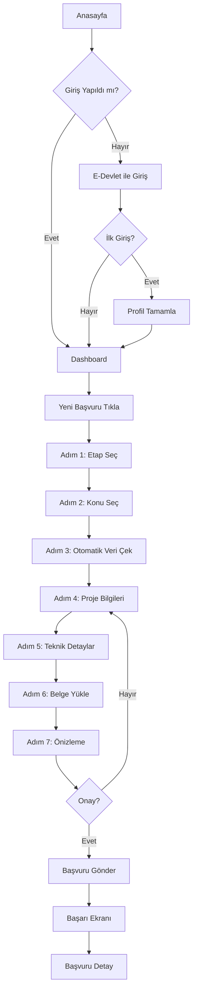
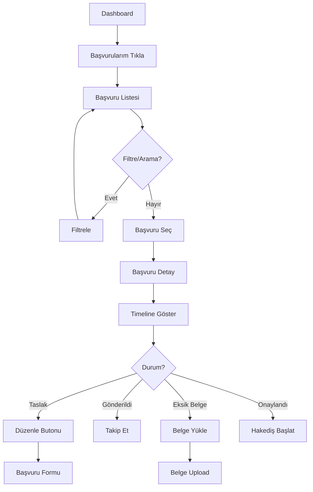

# 👨‍🌾 VATANDAŞ BAŞVURU SÜRECİ - PRODUCT OWNER ANALİZİ

## 📊 Executive Summary

### Modül Amacı
Çiftçilerin/yatırımcıların hibe başvurularını kolayca yapabilmeleri, takip edebilmeleri ve sistemi minimum eforla kullanabilmeleri.

### Temel Özellikler
- ✅ E-Devlet ile tek tıkla giriş
- ✅ Otomatik veri çekme (kişisel bilgiler)
- ✅ Adım adım wizard ile başvuru
- ✅ Otomatik taslak kaydetme
- ✅ Anlık başvuru takibi
- ✅ Mobil uyumlu arayüz

### İş Değeri
- **Kullanıcı Deneyimi**: %80 daha kolay başvuru
- **Zaman Tasarrufu**: %60 daha hızlı süreç
- **Hata Azalması**: %70 daha az eksik bilgi
- **Erişilebilirlik**: 7/24 online başvuru

---

## 🎭 User Personas

### Persona 1: Çiftçi Ahmet
```
┌─────────────────────────────────────┐
│  👨‍🌾 ÇİFTÇİ AHMET                   │
├─────────────────────────────────────┤
│ Yaş: 45                             │
│ Eğitim: İlkokul mezunu              │
│ Lokasyon: Konya/Karatay             │
│ Teknoloji: Akıllı telefon kullanıcı │
├─────────────────────────────────────┤
│ HEDEFLER:                           │
│ • Serasını büyütmek                 │
│ • Hibe desteği almak                │
│ • Gelirini artırmak                 │
├─────────────────────────────────────┤
│ PAIN POINTS:                        │
│ • Karmaşık formlar                  │
│ • Süreç takibi zorluğu              │
│ • Ofise gitmek zorunda              │
│ • Hangi belgelerin gerekli bilmeme  │
├─────────────────────────────────────┤
│ DAVRANIŞLAR:                        │
│ • Akşamları internet kullanır       │
│ • Video izleyerek öğrenir           │
│ • Komşularıyla bilgi paylaşır       │
└─────────────────────────────────────┘
```

### Persona 2: Genç Girişimci Elif
```
┌─────────────────────────────────────┐
│  👩‍💼 GİRİŞİMCİ ELİF                 │
├─────────────────────────────────────┤
│ Yaş: 28                             │
│ Eğitim: Üniversite mezunu           │
│ Lokasyon: İzmir/Menemen             │
│ Teknoloji: İleri düzey kullanıcı    │
├─────────────────────────────────────┤
│ HEDEFLER:                           │
│ • Organik tarım işletmesi kurmak    │
│ • Sürdürülebilir üretim             │
│ • İhracat yapmak                    │
├─────────────────────────────────────┤
│ PAIN POINTS:                        │
│ • Sermaye eksikliği                 │
│ • Bürokratik süreçler               │
│ • Bilgi eksikliği                   │
├─────────────────────────────────────┤
│ DAVRANIŞLAR:                        │
│ • Dijital platform tercih eder      │
│ • Hızlı işlem bekler                │
│ • Detaylı bilgi ister               │
└─────────────────────────────────────┘
```

---

## 📖 User Stories

### Epic 1: Başvuru Yapma

#### US-100: E-Devlet ile Giriş
```
As a çiftçi
I want to E-Devlet ile tek tıkla giriş yapmak
So that şifre oluşturmak zorunda kalmam

Acceptance Criteria:
✓ E-Devlet butonu açılış sayfasında görünür
✓ Buton tıklandığında E-Devlet sayfasına yönlendirir
✓ TC Kimlik No ve şifre/mobil imza ile giriş yapılır
✓ Başarılı girişte kullanıcı dashboard'a yönlendirilir
✓ İlk girişte profil tamamlama ekranı gösterilir
✓ Hatalı girişte açıklayıcı mesaj gösterilir

Story Points: 5
Priority: CRITICAL
Sprint: 1
```

#### US-101: Otomatik Profil Doldurma
```
As a başvuran
I want to kişisel bilgilerimin otomatik doldurulmasını
So that aynı bilgileri tekrar girmeyeyim

Acceptance Criteria:
✓ E-Devlet'ten TC, ad, soyad, doğum tarihi çekilir
✓ MERNİS'ten adres bilgileri çekilir
✓ ÇKS'den çiftçi kayıt numarası çekilir
✓ TAKBİS'ten arazi bilgileri çekilir
✓ Çekilen veriler form alanlarına otomatik doldurulur
✓ Kullanıcı gerekirse bilgileri düzenleyebilir
✓ Otomatik doldurulan alanlar yeşil işaretli gösterilir

Story Points: 8
Priority: HIGH
Sprint: 2
```

#### US-102: Adım Adım Başvuru Formu
```
As a başvuran
I want to başvuruyu adım adım yapmak
So that karmaşık forma boğulmayayım

Acceptance Criteria:
✓ Form 7 adıma bölünmüş (Etap seç, Konu seç, Bilgiler, Teknik, Belge, Önizleme, Gönder)
✓ Her adımda sadece ilgili alanlar gösterilir
✓ Progress bar ile hangi adımda olduğu gösterilir
✓ "İleri" ve "Geri" butonları çalışır
✓ Zorunlu alanlar doldurulmadan ileri gidilemez
✓ Her adımda validasyon yapılır
✓ Hata mesajları açıklayıcı ve Türkçe

Story Points: 13
Priority: CRITICAL
Sprint: 2-3
```

#### US-103: Otomatik Taslak Kaydetme
```
As a başvuran
I want to formun otomatik kaydedilmesini
So that işimi yarıda bırakmak zorunda kalsam bile kaybolmasın

Acceptance Criteria:
✓ Her 30 saniyede bir otomatik kayıt yapılır
✓ "Kaydediliyor..." göstergesi gösterilir
✓ Başarılı kayıtta "✓ Kaydedildi - X dakika önce" mesajı
✓ İnternet kesildiğinde local storage'a kayıt yapılır
✓ İnternet geldiğinde local storage senkronize edilir
✓ Taslaklar sayfasından devam edilebilir

Story Points: 8
Priority: HIGH
Sprint: 3
```

#### US-104: Belge Yükleme
```
As a başvuran
I want to belgelerimi kolayca yüklemek
So that evden çıkmadan başvurumu tamamlayayım

Acceptance Criteria:
✓ Drag & drop ile dosya yüklenir
✓ Birden fazla dosya aynı anda seçilebilir
✓ PDF, JPG, PNG formatları desteklenir
✓ Maksimum 10MB dosya boyutu
✓ Yükleme progress bar gösterilir
✓ Yüklenen dosya önizlemesi gösterilir
✓ Yüklenen dosya silinebilir
✓ Her belge tipi için kaç dosya gerekli bilgisi verilir
✓ Eksik belge varsa uyarı verilir

Story Points: 8
Priority: HIGH
Sprint: 3
```

#### US-105: Başvuru Önizleme
```
As a başvuran
I want to başvurumu göndermeden önce gözden geçirmek
So that hata yapmadığımdan emin olayım

Acceptance Criteria:
✓ Tüm girilen bilgiler özet ekranda gösterilir
✓ Her bölüm (Temel Bilgiler, Teknik Detaylar vb.) ayrı kartlarda
✓ Yüklenen belgeler liste halinde
✓ Düzenle butonları ile ilgili adıma geri dönülebilir
✓ "Başvuruyu Onayla ve Gönder" butonu açık yeşil
✓ Onay checkbox'ı işaretlenmeden gönderim yapılamaz

Story Points: 5
Priority: MEDIUM
Sprint: 3
```

#### US-106: Başvuru Gönderme ve Onay
```
As a başvuran
I want to başvurumu güvenle göndermek
So that işlemlerimin kaydını alayım

Acceptance Criteria:
✓ "Gönder" butonu tıklandığında onay popup gösterilir
✓ Popup'ta özet bilgiler (konu, tutar) gösterilir
✓ "Evet, Gönder" ve "İptal" butonları
✓ Gönderim sırasında loading gösterilir
✓ Başarılı gönderimde başvuru numarası gösterilir
✓ Başvuru numarası SMS ile gönderilir
✓ Başvuru PDF'i oluşturulur ve indirilebilir
✓ Başvuru detay sayfasına yönlendirilir

Story Points: 5
Priority: CRITICAL
Sprint: 3
```

### Epic 2: Başvuru Takibi

#### US-107: Başvuru Listesi
```
As a başvuran
I want to tüm başvurularımı görmek
So that durumlarını takip edeyim

Acceptance Criteria:
✓ Tablo formatında başvurular listelenir
✓ Kolonlar: Başvuru No, Konu, Tarih, Durum, Tutar
✓ Durum renk kodlu badge ile gösterilir
✓ Filtreleme yapılabilir (durum, tarih, konu)
✓ Arama yapılabilir (başvuru no)
✓ Sıralama yapılabilir (tarih, tutar)
✓ Sayfalama var (10 başvuru/sayfa)
✓ "Detay Gör" butonu her satırda

Story Points: 5
Priority: HIGH
Sprint: 4
```

#### US-108: Başvuru Detay ve Timeline
```
As a başvuran
I want to başvurumun hangi aşamada olduğunu görmek
So that ne zaman sonuçlanacağını bileyim

Acceptance Criteria:
✓ Timeline formatında süreç adımları gösterilir
✓ Tamamlanan adımlar yeşil ✓ ile işaretli
✓ Mevcut adım mavi ve yanıp sönen
✓ Gelecek adımlar gri
✓ Her adımda tarih ve yapan kişi bilgisi
✓ Reddedilmişse red nedeni açık yazılır
✓ Değerlendirme puanı varsa gösterilir
✓ Yüklenen belgeler listelenebilir

Story Points: 8
Priority: HIGH
Sprint: 4
```

#### US-109: Bildirimler
```
As a başvuran
I want to başvurumla ilgili bildirim almak
So that önemli güncellemeleri kaçırmayayım

Acceptance Criteria:
✓ Başvuru gönderildiğinde SMS ve e-posta
✓ Eksik belge istendiğinde bildirim
✓ Saha ziyareti planlandığında bildirim
✓ Karar verildiğinde (onay/red) bildirim
✓ Hakediş ödemesi yapıldığında bildirim
✓ Bildirimler sistemde de görüntülenir
✓ Okunmamış bildirim sayısı gösterilir
✓ Bildirim terciheri ayarlanabilir

Story Points: 8
Priority: MEDIUM
Sprint: 5
```

---

## 🎨 Screen Flows

### Başvuru Akışı



### Başvuru Takip Akışı



---

## 🖼️ Wireframes & Mockups

### 1. Giriş Ekranı

```
┌────────────────────────────────────────────────────┐
│                    KKYDP LOGO                      │
│         Kırsal Kalkınma Hibe Destek Sistemi        │
├────────────────────────────────────────────────────┤
│                                                    │
│     [İlk kez mi kullanıyorsunuz? Bilgi Alın]      │
│                                                    │
│         ┌──────────────────────────────┐          │
│         │    🏛️ E-DEVLET İLE GİRİŞ   │          │
│         │                              │          │
│         │  ► E-Devlet Şifreniz veya    │          │
│         │    Mobil İmzanız ile giriş   │          │
│         │    yapabilirsiniz.           │          │
│         │                              │          │
│         │   [E-Devlet ile Giriş Yap]   │          │
│         │                              │          │
│         └──────────────────────────────┘          │
│                                                    │
│     ┌────────────────────────────────────┐        │
│     │ 📱 Sistemimize Nasıl Giriş Yaparım?│        │
│     │ ► Video İzle                        │        │
│     └────────────────────────────────────┘        │
│                                                    │
│     ┌────────────────────────────────────┐        │
│     │ ❓ Sık Sorulan Sorular              │        │
│     └────────────────────────────────────┘        │
│                                                    │
│              Yardım: 444 0 444                     │
└────────────────────────────────────────────────────┘
```

### 2. Dashboard

```
┌─────────────────────────────────────────────────────────────┐
│  KKYDP  │  Dashboard  │  Başvurularım  │  Bildirimler (3)   │
├─────────────────────────────────────────────────────────────┤
│                                                              │
│  Hoş Geldiniz, AHMET YILMAZ                                 │
│                                                              │
│  ┌────────────────┐  ┌────────────────┐  ┌────────────────┐ │
│  │ 📋 TOPLAM      │  │ ✅ ONAYLANAN   │  │ ⏳ BEKLEYEN    │ │
│  │  BAŞVURU       │  │  BAŞVURU       │  │  BAŞVURU       │ │
│  │     3          │  │     1          │  │     2          │ │
│  └────────────────┘  └────────────────┘  └────────────────┘ │
│                                                              │
│  ┌──────────────────────────────────────────────────────┐   │
│  │  🎯 Hızlı İşlemler                                   │   │
│  ├──────────────────────────────────────────────────────┤   │
│  │  [➕ Yeni Başvuru Yap]                              │   │
│  │  [📂 Taslak Başvurular (1)]                         │   │
│  │  [📄 Belgelerim]                                    │   │
│  └──────────────────────────────────────────────────────┘   │
│                                                              │
│  ┌──────────────────────────────────────────────────────┐   │
│  │  📊 Son Başvurular                                   │   │
│  ├──────────────────────────────────────────────────────┤   │
│  │  Başvuru No    Konu           Tarih       Durum      │   │
│  │  ───────────────────────────────────────────────────│   │
│  │  2025-001      Sera Yapımı    01.09.25   [Onaylandı]│   │
│  │  2025-012      Soğuk Hava     15.09.25   [İnceleme]│   │
│  │  2025-045      Makine         28.09.25   [Taslak]   │   │
│  └──────────────────────────────────────────────────────┘   │
│                                                              │
│  ┌──────────────────────────────────────────────────────┐   │
│  │  🔔 Bildirimler                                      │   │
│  ├──────────────────────────────────────────────────────┤   │
│  │  • 2025-012 başvurunuz için saha ziyareti planlandı │   │
│  │    📅 15.10.2025 Saat 10:00                         │   │
│  │  • 2025-001 başvurunuz onaylandı! 🎉                │   │
│  │  • Yeni etap açıldı: Organik Tarım Desteği          │   │
│  └──────────────────────────────────────────────────────┘   │
└─────────────────────────────────────────────────────────────┘
```

### 3. Başvuru Wizard - Adım 1

```
┌─────────────────────────────────────────────────────────────┐
│  Yeni Başvuru Oluştur                              [X Kapat] │
├─────────────────────────────────────────────────────────────┤
│                                                              │
│  Progress: ████░░░░░░░░░░░░░░░░░░░░░░ 1/7                   │
│                                                              │
│  ╔════════════════════════════════════════════════════════╗ │
│  ║  ADIM 1: ETAP SEÇİMİ                                   ║ │
│  ╚════════════════════════════════════════════════════════╝ │
│                                                              │
│  Hangi etap için başvuru yapmak istiyorsunuz?               │
│                                                              │
│  ┌────────────────────────────────────────────────────┐     │
│  │  📋 Etap Seçiniz: *                                │     │
│  │  [▼ Seçiniz...                                  ▼] │     │
│  │                                                     │     │
│  │  Aktif Etaplar:                                    │     │
│  │  • KKYDP-2025-1 (Başvuru: 01.01.25 - 31.03.25)    │     │
│  │  • KKYDP-2025-2 (Başvuru: 01.04.25 - 30.06.25)    │     │
│  └────────────────────────────────────────────────────┘     │
│                                                              │
│  ℹ️  Seçili Etap Bilgileri:                                 │
│  ┌────────────────────────────────────────────────────┐     │
│  │  Etap Adı: KKYDP-2025-1                            │     │
│  │  Başvuru Dönemi: 01.01.2025 - 31.03.2025          │     │
│  │  Toplam Bütçe: 500.000.000 TL                      │     │
│  │  Kalan Bütçe: 350.000.000 TL                       │     │
│  │  Maksimum Destek: %50                              │     │
│  │                                                     │     │
│  │  [📄 Etap Detaylarını Görüntüle]                   │     │
│  └────────────────────────────────────────────────────┘     │
│                                                              │
│                                                              │
│  [💾 Taslak Kaydet]              [İleri >]                  │
│                                                              │
│  💡 İpucu: Başvuru yapmadan önce etap şartnamesini          │
│     incelemenizi öneririz.                                  │
└─────────────────────────────────────────────────────────────┘
```

### 4. Başvuru Wizard - Adım 4 (Otomatik Doldurulmuş)

```
┌─────────────────────────────────────────────────────────────┐
│  Yeni Başvuru Oluştur                              [X Kapat] │
├─────────────────────────────────────────────────────────────┤
│                                                              │
│  Progress: ████████████░░░░░░░░░░░ 4/7                      │
│                                                              │
│  ╔════════════════════════════════════════════════════════╗ │
│  ║  ADIM 4: PROJE BİLGİLERİ                               ║ │
│  ╚════════════════════════════════════════════════════════╝ │
│                                                              │
│  ┌────────────────────────────────────────────────────┐     │
│  │  👤 Başvuran Bilgileri                             │     │
│  ├────────────────────────────────────────────────────┤     │
│  │                                                     │     │
│  │  TC Kimlik No: *            ✅ Otomatik Dolduruldu │     │
│  │  [12345678901                                    ] │     │
│  │                                                     │     │
│  │  Ad Soyad: *                ✅ Otomatik Dolduruldu │     │
│  │  [AHMET YILMAZ                                   ] │     │
│  │                                                     │     │
│  │  Doğum Tarihi: *            ✅ Otomatik Dolduruldu │     │
│  │  [15.03.1978                                     ] │     │
│  │                                                     │     │
│  │  Telefon: *                                        │     │
│  │  [0532 123 45 67                                 ] │     │
│  │                                                     │     │
│  │  E-posta:                                          │     │
│  │  [ahmet.yilmaz@email.com                         ] │     │
│  │                                                     │     │
│  │  Adres: *                   ✅ Otomatik Dolduruldu │     │
│  │  [Karatay Mahallesi, No:123, Konya              ] │     │
│  │                                                     │     │
│  └────────────────────────────────────────────────────┘     │
│                                                              │
│  ┌────────────────────────────────────────────────────┐     │
│  │  🌾 Çiftçi Kayıt Bilgileri  ✅ Otomatik Dolduruldu │     │
│  ├────────────────────────────────────────────────────┤     │
│  │                                                     │     │
│  │  ÇKS Üretici No:                                   │     │
│  │  [42123456789                                    ] │     │
│  │                                                     │     │
│  │  Kayıtlı Arazi (Dekar):                           │     │
│  │  [250                                            ] │     │
│  │                                                     │     │
│  └────────────────────────────────────────────────────┘     │
│                                                              │
│  [< Geri]  [💾 Taslak Kaydet]              [İleri >]        │
│                                                              │
│  ✓ Son kaydedilme: 2 dakika önce                            │
└─────────────────────────────────────────────────────────────┘
```

### 5. Belge Yükleme Ekranı

```
┌─────────────────────────────────────────────────────────────┐
│  Yeni Başvuru Oluştur                              [X Kapat] │
├─────────────────────────────────────────────────────────────┤
│                                                              │
│  Progress: ████████████████████░░░ 6/7                      │
│                                                              │
│  ╔════════════════════════════════════════════════════════╗ │
│  ║  ADIM 6: BELGE YÜKLEME                                 ║ │
│  ╚════════════════════════════════════════════════════════╝ │
│                                                              │
│  📋 Yüklenmesi Gereken Belgeler                             │
│                                                              │
│  ┌────────────────────────────────────────────────────┐     │
│  │  1. Kimlik Fotokopisi * [✅ Tamamlandı 1/1]       │     │
│  ├────────────────────────────────────────────────────┤     │
│  │  📄 tc_kimlik.pdf (245 KB)                         │     │
│  │  Yüklenme: 09.10.2025 14:35  [👁️ Görüntüle] [🗑️]  │     │
│  └────────────────────────────────────────────────────┘     │
│                                                              │
│  ┌────────────────────────────────────────────────────┐     │
│  │  2. İmza Sirküleri * [⚠️ Eksik 0/1]               │     │
│  ├────────────────────────────────────────────────────┤     │
│  │                                                     │     │
│  │       ╔═══════════════════════════════╗            │     │
│  │       ║  📁 Dosyaları sürükleyip      ║            │     │
│  │       ║     bırakın veya tıklayın     ║            │     │
│  │       ║                               ║            │     │
│  │       ║  [Dosya Seç]                  ║            │     │
│  │       ╚═══════════════════════════════╝            │     │
│  │                                                     │     │
│  │  ℹ️  Kabul edilen formatlar: PDF, JPG, PNG         │     │
│  │  ℹ️  Maksimum dosya boyutu: 10 MB                  │     │
│  │  ℹ️  [📄 Örnek Belge İndir]                        │     │
│  └────────────────────────────────────────────────────┘     │
│                                                              │
│  ┌────────────────────────────────────────────────────┐     │
│  │  3. Arazi Tapusu * [❌ Yüklenmedi 0/1]            │     │
│  ├────────────────────────────────────────────────────┤     │
│  │                [Dosya Seç]                          │     │
│  └────────────────────────────────────────────────────┘     │
│                                                              │
│  ┌────────────────────────────────────────────────────┐     │
│  │  4. Proje Dosyası (Opsiyonel) [0/3]               │     │
│  ├────────────────────────────────────────────────────┤     │
│  │                [Dosya Seç]                          │     │
│  │  💡 İsteğe bağlı, maksimum 3 dosya yüklenebilir    │     │
│  └────────────────────────────────────────────────────┘     │
│                                                              │
│  [< Geri]  [💾 Taslak Kaydet]              [İleri >]        │
│                                                              │
│  ⚠️  2 zorunlu belge henüz yüklenmedi                       │
└─────────────────────────────────────────────────────────────┘
```

### 6. Önizleme Ekranı

```
┌─────────────────────────────────────────────────────────────┐
│  Yeni Başvuru Oluştur                              [X Kapat] │
├─────────────────────────────────────────────────────────────┤
│                                                              │
│  Progress: ███████████████████████ 7/7                      │
│                                                              │
│  ╔════════════════════════════════════════════════════════╗ │
│  ║  ADIM 7: ÖNİZLEME VE ONAY                              ║ │
│  ╚════════════════════════════════════════════════════════╝ │
│                                                              │
│  Başvurunuzu göndermeden önce kontrol ediniz:               │
│                                                              │
│  ┌────────────────────────────────────────────────────┐     │
│  │  📋 BAŞVURU ÖZETİ                          [Düzenle]│     │
│  ├────────────────────────────────────────────────────┤     │
│  │  Etap: KKYDP-2025-1                                │     │
│  │  Konu: Sera Yapımı                                 │     │
│  │  Alt Konu: Cam Sera                                │     │
│  └────────────────────────────────────────────────────┘     │
│                                                              │
│  ┌────────────────────────────────────────────────────┐     │
│  │  👤 BAŞVURAN BİLGİLERİ                     [Düzenle]│     │
│  ├────────────────────────────────────────────────────┤     │
│  │  Ad Soyad: Ahmet Yılmaz                            │     │
│  │  TC No: 12345678901                                │     │
│  │  Telefon: 0532 123 45 67                           │     │
│  │  E-posta: ahmet.yilmaz@email.com                   │     │
│  │  Adres: Karatay Mah., Konya                        │     │
│  └────────────────────────────────────────────────────┘     │
│                                                              │
│  ┌────────────────────────────────────────────────────┐     │
│  │  💰 FİNANSAL BİLGİLER                      [Düzenle]│     │
│  ├────────────────────────────────────────────────────┤     │
│  │  Toplam Yatırım Tutarı: 500.000 TL                │     │
│  │  Talep Edilen Destek: 250.000 TL (%50)            │     │
│  │  Kendi Katkısı: 250.000 TL (%50)                  │     │
│  └────────────────────────────────────────────────────┘     │
│                                                              │
│  ┌────────────────────────────────────────────────────┐     │
│  │  📄 YÜKLENEN BELGELER (4)                  [Düzenle]│     │
│  ├────────────────────────────────────────────────────┤     │
│  │  ✓ Kimlik Fotokopisi                               │     │
│  │  ✓ İmza Sirküleri                                  │     │
│  │  ✓ Arazi Tapusu                                    │     │
│  │  ✓ Proje Dosyası                                   │     │
│  └────────────────────────────────────────────────────┘     │
│                                                              │
│  ┌────────────────────────────────────────────────────┐     │
│  │  ☑️  Başvurumun doğruluğunu onaylıyorum           │     │
│  │  ☑️  KVKK Aydınlatma Metnini okudum, kabul ediyorum│     │
│  │  ☑️  Etap Şartnamesini okudum, kabul ediyorum      │     │
│  └────────────────────────────────────────────────────┘     │
│                                                              │
│  [< Geri]           [📄 PDF İndir]   [✅ BAŞVURU GÖNDER]    │
│                                                              │
└─────────────────────────────────────────────────────────────┘
```

### 7. Başvuru Başarılı Ekranı

```
┌─────────────────────────────────────────────────────────────┐
│                                                              │
│                                                              │
│                     ✅  BAŞARILI!                            │
│                                                              │
│            Başvurunuz başarıyla gönderildi.                 │
│                                                              │
│  ╔════════════════════════════════════════════════════════╗ │
│  ║                                                         ║ │
│  ║     Başvuru Numaranız:  KKYDP-2025-00142                ║ │
│  ║                                                         ║ │
│  ║     Başvuru Tarihi:     09.10.2025 - 15:30             ║ │
│  ║                                                         ║ │
│  ║     Etap:               KKYDP-2025-1                    ║ │
│  ║                                                         ║ │
│  ║     Konu:               Sera Yapımı                     ║ │
│  ║                                                         ║ │
│  ║     Talep Edilen:       250.000 TL                      ║ │
│  ║                                                         ║ │
│  ╚════════════════════════════════════════════════════════╝ │
│                                                              │
│  📱 Bu başvuru numarası SMS ile 0532 *** 45 67              │
│     numarasına gönderilmiştir.                              │
│                                                              │
│  ℹ️  Başvurunuz değerlendirmeye alınmıştır.                 │
│     Ortalama değerlendirme süresi: 30 gün                   │
│                                                              │
│  🔔 Başvurunuzla ilgili her gelişmede bildirim              │
│     alacaksınız.                                            │
│                                                              │
│  ┌────────────────────────────────────────────────────┐     │
│  │  [📄 Başvuru PDF'ini İndir]                        │     │
│  │                                                     │     │
│  │  [👁️ Başvuru Detayını Görüntüle]                   │     │
│  │                                                     │     │
│  │  [🏠 Ana Sayfaya Dön]                              │     │
│  └────────────────────────────────────────────────────┘     │
│                                                              │
│                                                              │
└─────────────────────────────────────────────────────────────┘
```

### 8. Başvuru Detay ve Timeline

```
┌─────────────────────────────────────────────────────────────┐
│  Başvuru Detayı: KKYDP-2025-00142                  [⬅️ Geri] │
├─────────────────────────────────────────────────────────────┤
│                                                              │
│  ┌────────────────────────────────────────────────────┐     │
│  │  DURUM: [🔵 Değerlendirmede]                       │     │
│  │                                                     │     │
│  │  Başvuru Tarihi: 09.10.2025                        │     │
│  │  Son Güncelleme: 15.10.2025 10:30                  │     │
│  │  Tahmini Sonuç: 08.11.2025                         │     │
│  └────────────────────────────────────────────────────┘     │
│                                                              │
│  📊 BAŞVURU İLERLEMESİ                                      │
│  ═══════════════════════════════════════════════════        │
│                                                              │
│   ┌─────────────────────────────────────────────┐           │
│   │ ✅ BAŞVURU OLUŞTURULDU                      │           │
│   │    09.10.2025 15:30                         │           │
│   │    Ahmet Yılmaz tarafından                  │           │
│   └─────────────────────────────────────────────┘           │
│         │                                                    │
│         ▼                                                    │
│   ┌─────────────────────────────────────────────┐           │
│   │ ✅ BELGE KONTROLÜ                           │           │
│   │    10.10.2025 09:15                         │           │
│   │    Tüm belgeler tamamlandı ✓                │           │
│   └─────────────────────────────────────────────┘           │
│         │                                                    │
│         ▼                                                    │
│   ┌─────────────────────────────────────────────┐           │
│   │ ✅ SAHA ZİYARETİ PLANLANDI                  │           │
│   │    11.10.2025 11:00                         │           │
│   │    📅 Ziyaret: 15.10.2025 Saat 10:00        │           │
│   └─────────────────────────────────────────────┘           │
│         │                                                    │
│         ▼                                                    │
│   ┌─────────────────────────────────────────────┐           │
│   │ 🔵 SAHA ZİYARETİ TAMAMLANDI                 │           │
│   │    15.10.2025 11:45                         │           │
│   │    Ziraat Müh. Ayşe Demir                   │           │
│   │    📸 12 fotoğraf yüklendi                  │           │
│   │    [Raporu Görüntüle]                       │           │
│   └─────────────────────────────────────────────┘           │
│         │                                                    │
│         ▼                                                    │
│   ┌─────────────────────────────────────────────┐           │
│   │ ⏳ TEKNİK DEĞERLENDİRME                     │           │
│   │    Bekleniyor...                            │           │
│   └─────────────────────────────────────────────┘           │
│         │                                                    │
│         ▼                                                    │
│   ┌─────────────────────────────────────────────┐           │
│   │ ⏱️ İL ONAY                                  │           │
│   │    Beklemede                                │           │
│   └─────────────────────────────────────────────┘           │
│         │                                                    │
│         ▼                                                    │
│   ┌─────────────────────────────────────────────┐           │
│   │ ⏱️ MERKEZ ONAY                              │           │
│   │    Beklemede                                │           │
│   └─────────────────────────────────────────────┘           │
│                                                              │
│  [📄 Başvuru PDF'ini İndir]  [💬 Destek Talebi Oluştur]    │
│                                                              │
└─────────────────────────────────────────────────────────────┘
```

---

## 📏 Business Rules

### BR-001: Başvuru Yapabilme
- Kullanıcı E-Devlet ile giriş yapmış olmalı
- TC Kimlik No doğrulanmış olmalı
- 18 yaşından büyük olmalı
- Aktif bir etap olmalı

### BR-002: Aynı Etapta Çoklu Başvuru
- Bir kişi aynı etap için sadece 1 başvuru yapabilir
- Farklı etaplar için ayrı ayrı başvuru yapılabilir
- Bir etaptaki başvuru reddedildiyse, aynı etapta tekrar başvuru yapılamaz

### BR-003: Taslak Kaydetme
- Taslak 30 gün süreyle saklanır
- 30 gün içinde tamamlanmazsa otomatik silinir
- Kullanıcı dilediği zaman taslağı silebilir

### BR-004: Belge Gereksinimleri
- Her etap için farklı belgeler tanımlanabilir
- Zorunlu belgeler yüklenmeden başvuru gönderilemez
- Opsiyonel belgeler sonradan eklenebilir
- Dosya formatları: PDF, JPG, PNG
- Maksimum dosya boyutu: 10MB

### BR-005: Destek Oranı Hesaplama
```
Maksimum Destek = Yatırım Tutarı × Destek Oranı (%)
Kendi Katkısı = Yatırım Tutarı - Maksimum Destek

Örnek:
Yatırım: 500.000 TL
Destek Oranı: %50
Maksimum Destek: 500.000 × 0.50 = 250.000 TL
Kendi Katkısı: 500.000 - 250.000 = 250.000 TL
```

---

## ⚠️ Edge Cases & Error Handling

### EC-001: E-Devlet Giriş Hatası
**Durum**: E-Devlet servisi yanıt vermiyor
**Çözüm**:
- Kullanıcıya açıklayıcı hata mesajı
- "Tekrar Dene" butonu
- Alternatif: "Daha sonra tekrar deneyin" mesajı
- Destek hattı bilgisi göster

### EC-002: Otomatik Veri Çekme Başarısız
**Durum**: MERNİS/ÇKS/TAKBİS servisleri yanıt vermiyor
**Çözüm**:
- Manuel veri girişi aktif hale gelir
- "⚠️ Otomatik veri çekilemedi, lütfen manuel giriniz" uyarısı
- Eksik veri alanları kırmızı işaretlenir

### EC-003: İnternet Bağlantısı Kesildi
**Durum**: Form doldurulurken internet kesilir
**Çözüm**:
- LocalStorage'a otomatik kaydet
- "📶 İnternet bağlantısı yok - Offline moddasınız" banner
- Bağlantı geldiğinde otomatik senkronize et

### EC-004: Taslak Süre Aşımı
**Durum**: 30 günlük taslak süresi dolmuş
**Çözüm**:
- Taslak otomatik silinir
- Kullanıcıya 7 gün önce e-posta/SMS uyarısı
- Silinen taslak 90 gün arşivde tutulur (kurtarma için)

### EC-005: Belge Yükleme Hatası
**Durum**: Belge yüklenirken hata oluşur
**Çözüm**:
- "❌ Yükleme başarısız, lütfen tekrar deneyin" mesajı
- Dosya boyutu/format kontrolü yap
- Detaylı hata mesajı göster (örn: "Dosya çok büyük")

### EC-006: Başvuru Gönderilirken Hata
**Durum**: Sunucu hatası
**Çözüm**:
- Başvuru otomatik taslak olarak kaydedilir
- "⚠️ Başvuru gönderilemedi ancak taslak olarak kaydedildi" mesajı
- "Tekrar Gönder" butonu
- Sistem yöneticisine otomatik bildirim

---

## 📈 Success Metrics

### Kullanıcı Metrikleri
- **Başvuru Tamamlama Oranı**: %90+ (hedef)
- **Ortalama Başvuru Süresi**: < 30 dakika
- **Kullanıcı Memnuniyeti**: 4.5/5 yıldız
- **Hata Oranı**: < %5
- **Mobil Kullanım**: %40+

### İşlem Metrikleri
- **Günlük Başvuru Sayısı**: 500+ (hedef)
- **Taslak → Gönderim Oranı**: %70+
- **İlk Denemede Başarı**: %85+
- **Belge Tamamlama**: %95+

### Teknik Metrikleri
- **Sayfa Yükleme**: < 2 saniye
- **Form Validasyon**: < 100ms
- **Otomatik Veri Çekme**: < 3 saniye
- **Uptime**: %99.5+

### Ölçüm Yöntemleri
- Google Analytics + Custom Events
- Hotjar (Heatmap & Session Recording)
- Sentry (Error Tracking)
- User Surveys (NPS)
- Backend Metrics (Prometheus)

---

## 🎯 Acceptance Test Scenarios

### Test 1: Happy Path - Tam Başvuru
```gherkin
Feature: Başarılı başvuru süreci

Scenario: Kullanıcı eksiksiz başvuru yapar
  Given Kullanıcı E-Devlet ile giriş yapmış
  When "Yeni Başvuru" butonuna tıklar
  And Etap seçer: "KKYDP-2025-1"
  And Konu seçer: "Sera Yapımı"
  And Tüm zorunlu alanları doldurur
  And Tüm zorunlu belgeleri yükler
  And Önizleme ekranında "Onayla" checkbox'ını işaretler
  And "Başvuruyu Gönder" butonuna tıklar
  Then Başvuru başarılı mesajı gösterilir
  And Başvuru numarası gösterilir
  And SMS bildirimi gönderilir
  And Başvuru PDF'i oluşturulur
  And Kullanıcı başvuru detay sayfasına yönlendirilir
```

### Test 2: Taslak Kaydetme ve Devam Etme
```gherkin
Scenario: Kullanıcı taslak kaydeder ve sonra devam eder
  Given Kullanıcı başvuru formunu doldurmaya başlamış
  When Formun yarısını doldurur
  And "Taslak Kaydet" butonuna tıklar
  Then "Taslak kaydedildi" mesajı gösterilir
  When Kullanıcı çıkış yapar
  And Tekrar giriş yapar
  And "Taslak Başvurular" sayfasına gider
  Then Kaydedilen taslak listelenir
  When Taslağa tıklar
  Then Form doldurduğu yerden devam eder
  And Tüm girdiği veriler korunmuştur
```

### Test 3: Belge Yükleme Validasyonu
```gherkin
Scenario: Kullanıcı hatalı dosya yükler
  Given Kullanıcı belge yükleme adımında
  When 15MB boyutunda dosya yüklemeye çalışır
  Then "Dosya boyutu 10MB'dan küçük olmalıdır" hatası gösterilir
  And Dosya yüklenmez
  When .exe uzantılı dosya yüklemeye çalışır
  Then "Sadece PDF, JPG, PNG formatları kabul edilir" hatası gösterilir
  And Dosya yüklenmez
```

---

**Hazırlayan**: Product Owner
**Son Güncelleme**: 09.10.2025
**Versiyon**: 1.0.0
