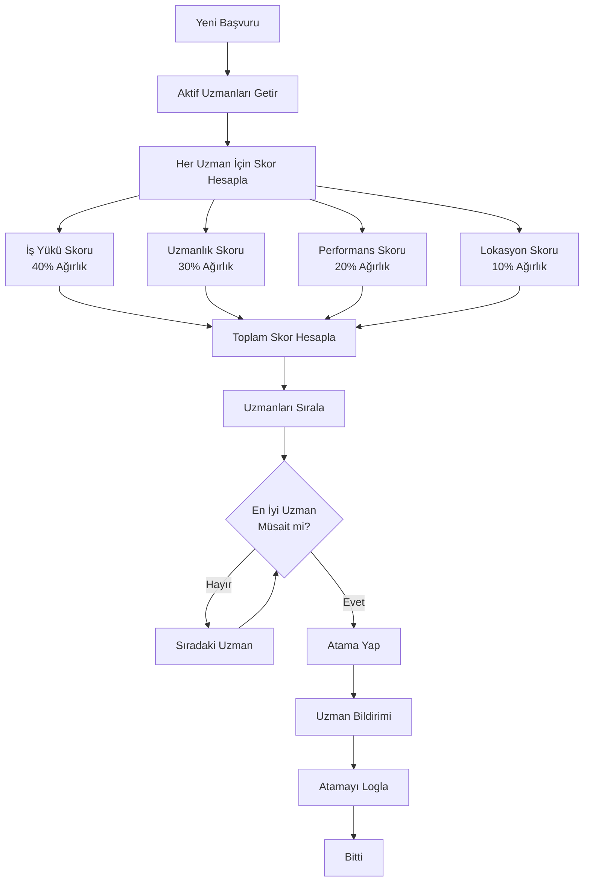
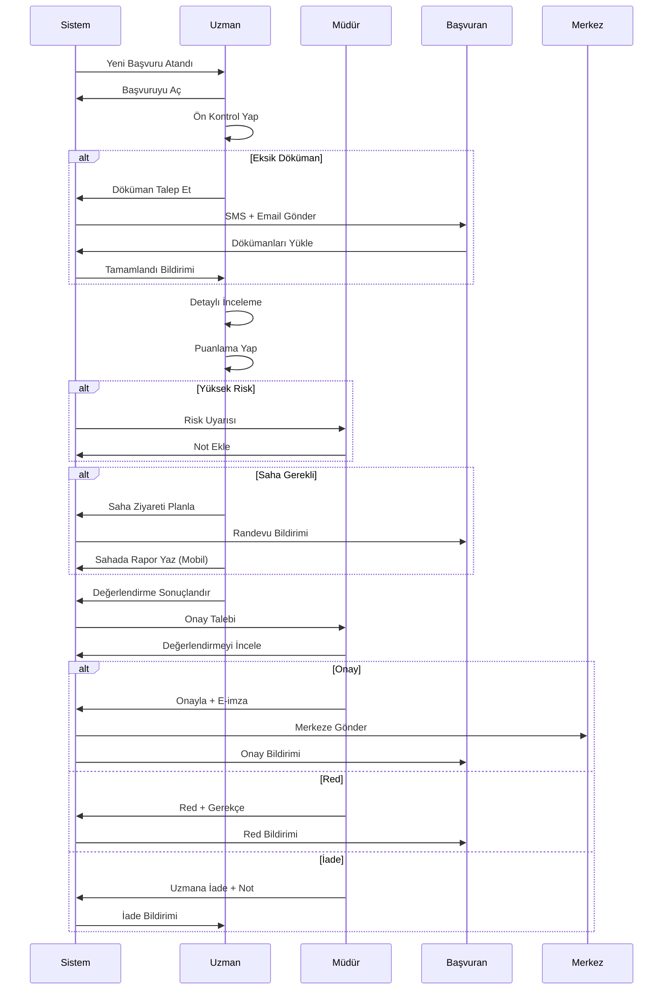

# 📋 PO-03: İL MÜDÜRLÜĞÜ DEĞERLENDİRME SÜRECİ

## 🎯 Executive Summary

### Modül Amacı
İl müdürlüğü personelinin başvuruları verimli bir şekilde değerlendirmesini, sahada ziyaret planlamasını, puanlama yapmasını ve karar süreçlerini yönetmesini sağlamak.

### Temel Özellikler
- ✅ **Akıllı Başvuru Atama**: İş yükü ve yetkinliğe göre otomatik atama
- ✅ **İki Aşamalı Değerlendirme**: Ön kontrol + Detaylı inceleme
- ✅ **Dinamik Puanlama Sistemi**: Etap kriterlerine göre otomatik puanlama
- ✅ **Saha Ziyareti Planlama**: Rota optimizasyonu ve takvim yönetimi
- ✅ **İş Birliği Araçları**: Ekip içi yorum, tartışma ve karar mekanizması
- ✅ **Mobil Uygulama Desteği**: Sahada anlık veri girişi
- ✅ **SLA Takibi**: Değerlendirme süresi kontrolü ve uyarılar

### İş Değeri
- **%60 Daha Hızlı Değerlendirme**: Otomatik ön kontrol ve puanlama
- **%95 SLA Uyumu**: Zamanında değerlendirme garantisi
- **%40 İş Yükü Dengeleme**: Adil ve verimli dağıtım
- **%50 Hata Azalması**: Otomatik kontroller ve validasyonlar

---

## 👥 User Personas

### Persona 1: Uzman Ayşe (Değerlendirme Uzmanı)

**Demografik Bilgiler:**
- **Yaş**: 32
- **Eğitim**: Ziraat Mühendisi
- **Pozisyon**: İl Müdürlüğü Değerlendirme Uzmanı
- **Deneyim**: 7 yıl kamu

**Hedefler:**
- Başvuruları adil ve objektif değerlendirmek
- Sahaya çıkmadan önce masaüstü değerlendirmeyi tamamlamak
- İş yükünü verimli yönetmek
- Kaliteli raporlar hazırlamak

**Pain Points:**
- Günlük 15-20 başvuru yığılması, hangi dosyaya öncelik vereceğini bilemiyor
- Excel'de manuel puanlama, hata riski yüksek
- Saha ziyareti planlarken rota optimizasyonu sorunu
- İl müdürü onayı beklerken süreçler uzuyor

**Davranış Kalıpları:**
- Sabah ilk iş yeni atanan dosyaları kontrol eder
- Dosyaları önce hızlı tarayıp eksikleri tespit eder
- Öğleden sonra detaylı inceleme ve puanlama yapar
- Hafta sonuna saha ziyaretlerini planlar

**Teknoloji Yetkinliği:**
- İleri düzey Office programları
- Orta düzey sistem kullanımı
- Mobil uygulamalara aşina
- Hızlı öğrenen, adaptasyon yüksek

**Success Criteria:**
- Günlük hedef: 10 dosya değerlendirmesi
- SLA içinde tüm dosyaları tamamlamalı
- Hata oranı %5'in altında
- Saha ziyaretlerini verimli planlamalı

---

### Persona 2: Müdür Mehmet (İl Müdürü)

**Demografik Bilgiler:**
- **Yaş**: 48
- **Eğitim**: Yüksek Lisans (Tarım Ekonomisi)
- **Pozisyon**: İl Müdürü
- **Deneyim**: 22 yıl kamu

**Hedefler:**
- İldeki tüm başvuruları zamanında sonuçlandırmak
- Bütçeyi verimli kullanmak, en uygun projeleri desteklemek
- Ekip performansını izlemek ve yönlendirmek
- Merkeze düzenli raporlama yapmak

**Pain Points:**
- 50+ uzman var, her birinin iş yükünü takip etmek zor
- Riskli başvurular geç fark ediliyor
- Bütçe dolmak üzere ama kaliteli başvuru az
- Merkez sürekli rapor ve açıklama istiyor

**Davranış Kalıpları:**
- Günde 2-3 kez dashboard'a bakar
- Kritik dosyaların detayına girer
- Haftalık ekip toplantısı yapar
- Risk durumlarında hızlı müdahale eder

**Teknoloji Yetkinliği:**
- Temel bilgisayar kullanımı
- Dashboard okuma
- Mobil cihazdan takip
- E-imza kullanımı

**Success Criteria:**
- Tüm başvurular SLA içinde
- Bütçe kullanım oranı %90+
- Başarılı proje oranı %80+
- Ekip memnuniyeti yüksek

---

## 📖 User Stories

### Epic 1: Başvuru Yönetimi ve Atama

#### US-301: Akıllı Başvuru Atama

**As an** İl Müdürü (Mehmet)
**I want** başvuruların uzmanlara otomatik ve adil dağıtılmasını
**So that** iş yükü dengeli olsun ve uzmanlar en uygun dosyaları alsın

**Acceptance Criteria:**
- ✅ Sistem başvuru geldiğinde otomatik atama önerir
- ✅ Atama kriterleri: Mevcut iş yükü (ağırlık %40), Uzmanlık alanı (ağırlık %30), Geçmiş performans (ağırlık %20), Coğrafi yakınlık (ağırlık %10)
- ✅ Manuel müdahale imkanı: Müdür atamayı değiştirebilir
- ✅ Uzman başına maksimum eşzamanlı dosya limiti: 15 aktif dosya
- ✅ Atama yapılınca uzman e-posta ve sistem bildirimi alır
- ✅ Atama geçmişi loglanır

**Story Points:** 13
**Priority:** CRITICAL
**Sprint:** 7

---

#### US-302: Başvuru Listesi ve Filtreleme

**As a** Değerlendirme Uzmanı (Ayşe)
**I want** bana atanan başvuruları filtreleyerek görmek
**So that** öncelikli dosyalara odaklanabileyim

**Acceptance Criteria:**
- ✅ Liste kolonları: Başvuru No, Başvuran Adı, Sektör, Tutar, Durum, Kalan Gün, Öncelik
- ✅ Filtreler: Durum (Yeni, İnceleniyor, Saha Bekleniyor, Tamamlandı), Sektör, Tarih aralığı, Öncelik
- ✅ Sıralama: Kalan gün (artan/azalan), Tutar, Başvuru tarihi
- ✅ Arama: Başvuru no, TC Kimlik, Firma adı ile arama
- ✅ Toplu işlem: Seçili dosyaları toplu güncelleme
- ✅ Excel export

**Story Points:** 5
**Priority:** HIGH
**Sprint:** 7

---

#### US-303: Başvuru Detay Görüntüleme

**As a** Değerlendirme Uzmanı (Ayşe)
**I want** başvuru detaylarını tek ekranda görmek
**So that** hızlı ve kapsamlı inceleme yapabileyim

**Acceptance Criteria:**
- ✅ Sol panel: Başvuran bilgileri, Proje özeti, Dökümanlar
- ✅ Orta panel: Form verileri (tab'lara bölünmüş)
- ✅ Sağ panel: Değerlendirme formu, Notlar, Tarihçe
- ✅ Otomatik çekilen veriler: MERNİS, TAKBİS, ÇKS, VEDOP verileri ayrı sekmelerde
- ✅ Döküman viewer: PDF/Image önizleme
- ✅ Zoom, print, download özellikleri

**Story Points:** 13
**Priority:** CRITICAL
**Sprint:** 7-8

---

### Epic 2: Değerlendirme ve Puanlama

#### US-304: Ön Kontrol (İlk Değerlendirme)

**As a** Değerlendirme Uzmanı (Ayşe)
**I want** başvurunun ön kontrolünü hızlıca yapmak
**So that** eksik veya uygunsuz dosyaları erken tespit edebiliyim

**Acceptance Criteria:**
- ✅ Otomatik kontroller listesi: Zorunlu dökümanlar, Form eksiksizliği, Uygunluk kriterleri
- ✅ Her kontrol için: ✅ Uygun / ❌ Uygun Değil / ⚠️ Şüpheli
- ✅ Red gerekçesi seçimi (dropdown): Eksik döküman, Uygunluk şartı sağlamıyor, vs.
- ✅ Uygun değilse: "Ön Red" aksiyonu, başvurana 5 gün içinde tamamlama hakkı
- ✅ Uygunsa: "Detaylı İncelemeye Geç" butonu
- ✅ Ön kontrol süresi: 2 iş günü (SLA)

**Story Points:** 8
**Priority:** CRITICAL
**Sprint:** 8

---

#### US-305: Dinamik Puanlama Formu

**As a** Değerlendirme Uzmanı (Ayşe)
**I want** etap kriterlerine göre puanlama yapmak
**So that** objektif ve standart değerlendirme yapabileyim

**Acceptance Criteria:**
- ✅ Puanlama formu etap tanımından otomatik gelir
- ✅ Her kriter için: Puan girişi (0-100), Açıklama alanı (opsiyonel)
- ✅ Alt kriterler varsa accordion ile gösterilir
- ✅ Otomatik puanlananlar: Sistem tarafından doldurulmuş, düzenlenebilir
- ✅ Toplam puan: Ağırlıklı ortalama olarak otomatik hesaplanır
- ✅ Minimum geçme puanı gösterilir, altındaysa uyarı
- ✅ Ara kayıt: Taslak olarak kaydedip daha sonra devam edebilme

**Story Points:** 13
**Priority:** CRITICAL
**Sprint:** 8

---

#### US-306: Risk Değerlendirmesi

**As a** Değerlendirme Uzmanı (Ayşe)
**I want** sistemin risk skorunu görmek ve yorumlamak
**So that** riskli başvurulara ekstra dikkat edebiliyim

**Acceptance Criteria:**
- ✅ AI risk skoru: 0-100 arası, renk kodlu (Yeşil: 0-30, Sarı: 31-60, Kırmızı: 61-100)
- ✅ Risk faktörleri listesi: Neyin riski artırdığı açıklanır
- ✅ Geçmiş benzer projeler: Başarı oranları gösterilir
- ✅ Başvuranın geçmişi: Daha önce aldığı destekler, başarı durumu
- ✅ Manuel risk notu: Uzman kendi risk değerlendirmesini ekleyebilir
- ✅ Yüksek risk (>60) durumunda: Otomatik müdür bilgilendirmesi

**Story Points:** 8
**Priority:** HIGH
**Sprint:** 9

---

### Epic 3: Saha Ziyareti Yönetimi

#### US-307: Saha Ziyareti Planlama

**As a** Değerlendirme Uzmanı (Ayşe)
**I want** saha ziyaretlerimi verimli planlamak
**So that** zamanımı optimize edip daha fazla dosya değerlendirebileyim

**Acceptance Criteria:**
- ✅ Saha bekleyen dosyalar haritada gösterilir
- ✅ Rota önerisi: Yakın lokasyonlar gruplanır
- ✅ Takvim entegrasyonu: Müsait günler gösterilir
- ✅ Ziyaret planı oluştur: Tarih, saat, dosyalar seçimi
- ✅ Başvurana otomatik bildirim: SMS + E-posta (randevu detayları)
- ✅ Mobil app senkronizasyonu: Planlanan ziyaretler mobilde görünür

**Story Points:** 13
**Priority:** HIGH
**Sprint:** 9-10

---

## 🔄 İş Akışları (Workflows)

### Workflow 1: Başvuru Atama Algoritması

---

### Workflow 2: İl Değerlendirme Tam Akışı

---

## 📊 Success Metrics

| Metrik | Hedef | Ölçüm Yöntemi |
|--------|-------|---------------|
| **Ortalama Değerlendirme Süresi** | < 5 gün | Atama - Sonuçlandırma arası süre |
| **SLA Uyum Oranı** | > %95 | Zamanında tamamlanan / Toplam |
| **Otomatik Red Oranı** | %15-20 | Ön kontrolde red / Toplam |
| **İş Yükü Dengesi** | Std. Sapma < 3 dosya | Uzmanlar arası dosya sayısı farkı |
| **Saha Verimliliği** | 5+ ziyaret/gün | Günlük ortalama ziyaret sayısı |

---

**Hazırlayan**: Product Owner
**Son Güncelleme**: 09.10.2025
**Versiyon**: 1.0.0

