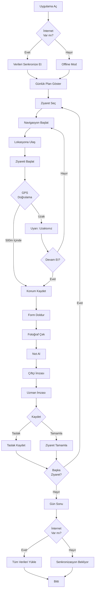

# 📋 PO-04: SAHA ZİYARETİ MOBİL UYGULAMA

## 🎯 Executive Summary

### Modül Amacı
Saha değerlendirme uzmanlarının mobil uygulama ile offline çalışabilmesini, GPS tabanlı konum doğrulamasını, fotoğraf/video kaydını ve anlık raporlamayı sağlamak.

### Temel Özellikler
- ✅ **Offline Çalışma**: İnternetsiz ortamda tam fonksiyonellik
- ✅ **GPS Doğrulama**: Konum bazlı ziyaret onayı
- ✅ **Multimedya Desteği**: Fotoğraf, video, ses kaydı
- ✅ **Dinamik Kontrol Listeleri**: Etap bazlı özel formlar
- ✅ **E-imza Entegrasyonu**: Başvuran ve uzman imzası
- ✅ **Otomatik Senkronizasyon**: Online olunca veri aktarımı
- ✅ **Rota Optimizasyonu**: En verimli ziyaret rotası

### İş Değeri
- **%80 Zaman Tasarrufu**: Ofise dönüp rapor yazmaya gerek yok
- **%95 Veri Doğruluğu**: Anında kayıt, hatırlamaya gerek yok
- **%100 Konum Doğrulaması**: GPS ile sahtekarlık önleme
- **%60 Kağıt Tasarrufu**: Dijital formlar ve imzalar

---

## 👥 User Personas

### Persona: Uzman Ahmet (Saha Değerlendirme Uzmanı)

**Demografik Bilgiler:**
- **Yaş**: 29
- **Eğitim**: Ziraat Mühendisi
- **Pozisyon**: Saha Değerlendirme Uzmanı
- **Deneyim**: 4 yıl kamu

**Hedefler:**
- Günde 5-7 saha ziyareti yapmak
- Sahada detaylı ve eksiksiz rapor hazırlamak
- Fotoğraflarla kanıt toplamak
- Çiftçilerle etkili iletişim kurmak

**Pain Points:**
- Kırsal alanda mobil internet zayıf/yok
- Not defterine yazıp sonra bilgisayara aktarma zahmeti
- Fotoğraflar kaybolabiliyor, karışabiliyor
- Konum/mesafe bilgilerini manuel hesaplama

**Davranış Kalıpları:**
- Sabah erken sahadayken ziyaretleri planlar
- Her ziyarette çok sayıda fotoğraf çeker
- Akşam ofiste günlük raporlarını yazar
- Hafta sonu evden de sisteme bakabilmek ister

**Teknoloji Yetkinliği:**
- İleri düzey akıllı telefon kullanımı
- Mobil uygulamalara aşina
- Google Maps, navigasyon uygulamaları kullanır
- Hızlı adaptasyon yeteneği

**Success Criteria:**
- Günde 7 ziyaret tamamlayabilmeli
- Rapor yazma süresi %80 azalmalı
- Tüm veriler gerçek zamanlı kaydedilmeli
- Offline çalışabilmeli

---

## 📖 User Stories

### Epic 1: Ziyaret Planlama ve Navigasyon

#### US-401: Günlük Ziyaret Planı

**As a** Saha Uzmanı (Ahmet)
**I want** bugünün ziyaretlerimi harita üzerinde görmek
**So that** en verimli rotayı planlayabileyim

**Acceptance Criteria:**
- ✅ Bugünün ziyaretleri haritada pin olarak görünür
- ✅ Her pin: Başvuran adı, adres, mesafe gösterir
- ✅ "Rota Optimizasyonu" butonu: En kısa rotayı hesaplar
- ✅ Liste görünümü: Ziyaret sırası, tahmini varış saatleri
- ✅ Navigasyon: Google Maps/Yandex Maps entegrasyonu
- ✅ Başvuranı ara: Direkt arama butonu

**Story Points:** 13
**Priority:** CRITICAL
**Sprint:** 12

---

#### US-402: Ziyaret Başlatma ve GPS Doğrulama

**As a** Saha Uzmanı (Ahmet)
**I want** ziyareti başlatırken konumumu doğrulatmak
**So that** sahte ziyaret yapılamadığından emin olunabilsin

**Acceptance Criteria:**
- ✅ "Ziyareti Başlat" butonu: GPS konumunu kontrol eder
- ✅ Konum doğrulama: Başvuranın adresine 500m içinde olmalı
- ✅ Uzaktaysa: "500m dışındasınız, devam etmek istiyor musunuz?" uyarısı
- ✅ Ziyaret başladığında: Otomatik timestamp ve konum kaydı
- ✅ Background tracking: Ziyaret sırasında konum geçmişi
- ✅ Ziyaret süresi: Otomatik hesaplama

**Story Points:** 8
**Priority:** CRITICAL
**Sprint:** 12

---

### Epic 2: Saha Değerlendirme ve Kayıt

#### US-403: Dinamik Değerlendirme Formu

**As a** Saha Uzmanı (Ahmet)
**I want** etap kriterlerine göre saha formunu doldurmak
**So that** standart ve eksiksiz değerlendirme yapabileyim

**Acceptance Criteria:**
- ✅ Form etap tanımından otomatik gelir
- ✅ Alan tipleri: Metin, sayı, checkbox, radio, fotoğraf, imza
- ✅ Zorunlu alanlar: Doldurulmadan ilerlenemez
- ✅ Koşullu alanlar: Belirli şartlarda görünür
- ✅ Ara kayıt: Taslak olarak kaydedip devam edebilme
- ✅ Offline çalışma: İnternetsiz doldurma

**Story Points:** 13
**Priority:** CRITICAL
**Sprint:** 13

---

#### US-404: Fotoğraf ve Video Çekme

**As a** Saha Uzmanı (Ahmet)
**I want** sahada fotoğraf/video çekmek ve etiketlemek
**So that** görsel kanıt toplayabileyim

**Acceptance Criteria:**
- ✅ Kamera entegrasyonu: Uygulama içinden fotoğraf/video çekme
- ✅ Otomatik metadata: GPS, timestamp, dosya adı
- ✅ Etiketleme: "Sera dış görünüm", "Sulama sistemi" vb. kategoriler
- ✅ Maksimum: 20 fotoğraf, 3 video (max 2dk)
- ✅ Thumbnail önizleme: Galeri görünümü
- ✅ Silme/düzenleme: Yanlış çekilen silinebilir

**Story Points:** 13
**Priority:** HIGH
**Sprint:** 13

---

#### US-405: Ses Kaydı (Notlar için)

**As a** Saha Uzmanı (Ahmet)
**I want** ses kaydı yaparak hızlı not almak
**So that** yazı yazmadan detayları kaydedebiliyim

**Acceptance Criteria:**
- ✅ Ses kayıt butonu: 5 dakikaya kadar kayıt
- ✅ Otomatik transkripsiyon: Speech-to-text (opsiyonel)
- ✅ Ses dosyası: Başvuru ile ilişkilendirilir
- ✅ Playback: Kaydı tekrar dinleme
- ✅ Çoklu kayıt: Birden fazla ses notu

**Story Points:** 8
**Priority:** MEDIUM
**Sprint:** 14

---

### Epic 3: İmza ve Onay

#### US-406: Çiftçi E-imzası

**As a** Saha Uzmanı (Ahmet)
**I want** çiftçinin ziyareti onaylamasını sağlamak
**So that** ziyaretin gerçekleştiğini kanıtlayabileyim

**Acceptance Criteria:**
- ✅ İmza ekranı: Parmakla imza çizme alanı
- ✅ TC kimlik onayı: İmza öncesi TC kimlik doğrulama
- ✅ Beyan metni: "Ziyaret gerçekleşti, bilgiler doğrudur" metni gösterilir
- ✅ İmza kaydı: PNG olarak kaydedilir
- ✅ İmza iptal: Yeniden imza alma imkanı
- ✅ Timestamp: İmza zamanı kaydedilir

**Story Points:** 8
**Priority:** CRITICAL
**Sprint:** 14

---

## 🔄 İş Akışları (Workflows)

### Workflow 1: Günlük Saha Ziyareti Akışı

---

## 📊 Success Metrics

| Metrik | Hedef | Ölçüm Yöntemi |
|--------|-------|---------------|
| **Ziyaret Başına Süre** | < 45 dakika | Başla - Bitir timestamp |
| **Günlük Ziyaret Sayısı** | 7+ ziyaret | Tamamlanan ziyaret / Gün |
| **Fotoğraf Sayısı** | Ortalama 12 foto/ziyaret | Toplam foto / Ziyaret |
| **GPS Doğrulama Başarısı** | > %95 | İlk denemede 500m içi |
| **Offline Kullanım** | %40+ ziyaretlerde | Offline mod kullanımı |
| **Senkronizasyon Başarısı** | %99.9 | Başarılı upload / Toplam |

---

**Hazırlayan**: Product Owner
**Son Güncelleme**: 09.10.2025
**Versiyon**: 1.0.0
