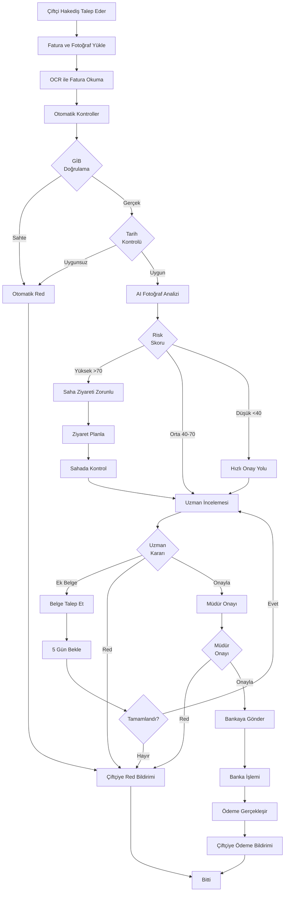

# 📋 PO-06: HAKEDİŞ VE ÖDEME SÜRECİ

## 🎯 Executive Summary

### Modül Amacı
Onaylanan projelerin fiziki gerçekleşme oranına göre hakediş taleplerini yönetmek, saha kontrolü yapmak ve ödemeleri işlemek.

### Temel Özellikler
- ✅ **Çoklu Hakediş**: Ara ödeme + Final ödemesi
- ✅ **Fotoğraflı Saha Kontrol**: Mobil app ile ilerleme takibi
- ✅ **AI Fotoğraf Analizi**: Otomatik ilerleme tespiti
- ✅ **Banka Entegrasyonu**: Ziraat Bankası ödeme sistemine otomatik gönderim
- ✅ **Fatura/Dekont Kontrolü**: OCR ile belge okuma
- ✅ **İlerleme Raporu**: Grafik ve timeline gösterimi
- ✅ **Ödeme Takibi**: Banka ödemelerini gerçek zamanlı izleme

### İş Değeri
- **%70 Süreç Hızlanması**: Otomatik kontroller ve banka entegrasyonu
- **%90 Fatura Doğruluğu**: OCR ile otomatik okuma
- **%100 Ödeme İzlenebilirliği**: Banka entegrasyonu ile takip
- **%50 Hile Önleme**: AI fotoğraf analizi ile kontrol

---

## 👥 User Personas

### Persona 1: Çiftçi Ahmet (Hibe Alan)

**Demografik Bilgiler:**
- **Yaş**: 45
- **Hedef**: Hakediş almak, projeyi tamamlamak

**Pain Points:**
- Hakediş süreci uzun sürüyor
- Hangi belgeleri göndereceğini bilemiyor
- Ödeme ne zaman gelir bilinmiyor
- Fatura/fişleri toplamak zahmetli

**Success Criteria:**
- Hakediş talebini kolayca yapabilmeli
- Ödeme takibi yapabilmeli
- 10 gün içinde ödeme almalı

---

### Persona 2: Uzman Ayşe (Hakediş Kontrol)

**Demografik Bilgiler:**
- **Yaş**: 32
- **Pozisyon**: Hakediş Kontrol Uzmanı

**Hedefler:**
- Hakediş taleplerini hızlı değerlendirmek
- Sahada ilerlemeyi doğrulamak
- Belgeleri kontrol etmek
- Ödeme sürecini başlatmak

**Pain Points:**
- Faturalar sahte olabiliyor
- Saha ziyareti planlamak zor
- Fotoğraflar yetersiz veya yanlış olabiliyor
- Manuel hesaplamalar hata riski

**Success Criteria:**
- Günde 8-10 hakediş değerlendirmeli
- Sahte belge tespit edebilmeli
- Saha ziyaretleri verimli planlanmalı
- 5 gün içinde karar verebilmeli

---

## 📖 User Stories

### Epic 1: Hakediş Talep Oluşturma

#### US-601: Hakediş Talep Formu

**As a** Çiftçi (Ahmet)
**I want** hakediş talebini online oluşturmak
**So that** fiziki başvuru yapmak zorunda kalmayayım

**Acceptance Criteria:**
- ✅ Hakediş türü seçimi: Ara Ödeme (max %70) / Final Ödeme (%30)
- ✅ İlerleme oranı: %kaç tamamlandı (slider)
- ✅ Talep tutarı: Otomatik hesaplama (Onay tutarı × İlerleme oranı)
- ✅ Fatura/dekont yükleme: PDF/JPG, max 20 dosya
- ✅ İlerleme fotoğrafları: 10-30 adet fotoğraf (önce-sonra)
- ✅ Açıklama: Neler yapıldı (min 100 karakter)
- ✅ Taslak kayıt: Daha sonra devam edebilme

**Story Points:** 13
**Priority:** CRITICAL
**Sprint:** 18

---

#### US-602: Fatura/Dekont Yükleme ve OCR

**As a** Çiftçi (Ahmet)
**I want** fatura yüklerken otomatik bilgi çekilmesini
**So that** manuel girişten kurtulayım

**Acceptance Criteria:**
- ✅ Fatura yükle: PDF veya fotoğraf
- ✅ OCR okuma: Firma, Tutar, Tarih, KDV otomatik çekilir
- ✅ Manuel düzeltme: OCR hatalıysa elle düzeltme
- ✅ Toplam tutar: Tüm faturalar toplamı gösterilir
- ✅ Kontrol: "Toplam tutar talep tutarından fazla olamaz" uyarısı
- ✅ Fatura doğrulama: GİB e-fatura sisteminden doğrulama

**Story Points:** 13
**Priority:** HIGH
**Sprint:** 18

---

### Epic 2: Hakediş Değerlendirme

#### US-603: Hakediş Listesi ve Filtreleme

**As a** Hakediş Uzmanı (Ayşe)
**I want** hakediş taleplerini filtreleyerek görmek
**So that** öncelikli taleplere odaklanabiliym

**Acceptance Criteria:**
- ✅ Liste: Başvuran, Proje, Talep Tutarı, İlerleme %, Tarih, Durum
- ✅ Filtreler: Durum, İlerleme aralığı, Tutar aralığı, Tarih
- ✅ Renk kodları: Yeni (Mavi), İnceleniyor (Sarı), Onaylandı (Yeşil), Red (Kırmızı)
- ✅ SLA uyarısı: 5 gün geçenler vurgulanır
- ✅ Arama: Başvuru no, TC kimlik, firma

**Story Points:** 5
**Priority:** HIGH
**Sprint:** 19

---

#### US-604: Belge Kontrol ve Validasyon

**As a** Hakediş Uzmanı (Ayşe)
**I want** faturaları otomatik kontrol etmek
**So that** sahte belgeleri hızlı tespit edebiliyim

**Acceptance Criteria:**
- ✅ GİB e-fatura kontrolü: Gerçek mi sahte mi?
- ✅ Tutar kontrolü: Fatura toplamı ≤ Talep tutarı
- ✅ Tarih kontrolü: Faturalar proje tarihleri arasında olmalı
- ✅ Firma kontrolü: Fatura başvuran adına olmalı
- ✅ Duplicate kontrolü: Aynı fatura daha önce kullanıldı mı?
- ✅ Uyarı raporu: Şüpheli durumlar listelenir

**Story Points:** 13
**Priority:** CRITICAL
**Sprint:** 19

---

#### US-605: AI Fotoğraf Analizi

**As a** Hakediş Uzmanı (Ayşe)
**I want** fotoğrafların AI ile analiz edilmesini
**So that** gerçek ilerlemeyi doğrulayabileyim

**Acceptance Criteria:**
- ✅ Önce-sonra karşılaştırma: AI iki fotoğrafı karşılaştırır
- ✅ İlerleme tahmini: "%75 tamamlanmış gibi görünüyor"
- ✅ Anomali tespiti: Photoshop veya manipülasyon uyarısı
- ✅ Nesne tanıma: "Sera, sulama sistemi, ekipman tespit edildi"
- ✅ Risk skoru: 0-100 arası güvenilirlik skoru
- ✅ Manuel doğrulama: Uzman AI önerisini onaylar/reddeder

**Story Points:** 21
**Priority:** HIGH
**Sprint:** 20

---

#### US-606: Saha Kontrol Ziyareti

**As a** Hakediş Uzmanı (Ayşe)
**I want** sahada hakediş kontrolü yapmak
**So that** fiziki gerçekleşmeyi doğrulayabileyim

**Acceptance Criteria:**
- ✅ Mobil uygulama: Hakediş için saha formu
- ✅ GPS doğrulama: Proje lokasyonunda olma zorunluluğu
- ✅ Fotoğraf çekme: Güncel durum fotoğrafları (zorunlu 10 adet)
- ✅ İlerleme onayı: %kaç tamamlandı (slider)
- ✅ Uygunluk raporu: "Uygun / Uygunsuz / Kısmi Uygun"
- ✅ Önerilen tutar: Uzman tavsiye tutar girer

**Story Points:** 13
**Priority:** HIGH
**Sprint:** 20

---

### Epic 3: Onay ve Ödeme

#### US-607: Hakediş Onay İşlemi

**As a** Hakediş Uzmanı (Ayşe)
**I want** hakediş talebini onaylamak veya reddetmek
**So that** ödeme süreci başlatılabilsin

**Acceptance Criteria:**
- ✅ Karar seçenekleri: Onayla (tam), Onayla (kısmi), Reddet, Ek Belge İste
- ✅ Onay tutarı: Talep edilen ≠ Onaylanan olabilir
- ✅ Gerekçe: Red/kısmi onayda zorunlu
- ✅ Müdür onayı: İl müdürü son onay verir
- ✅ Bildirimler: Çiftçi SMS + Email alır
- ✅ Ödeme talimatı: Banka sistemine otomatik gider

**Story Points:** 8
**Priority:** CRITICAL
**Sprint:** 21

---

#### US-608: Banka Entegrasyonu ve Ödeme Takibi

**As a** Çiftçi (Ahmet)
**I want** ödeme durumunu takip etmek
**So that** param ne zaman gelecek bilebileyim

**Acceptance Criteria:**
- ✅ Ödeme durumu: Onaylandı → Bankaya Gönderildi → Ödendi
- ✅ Banka entegrasyonu: Ziraat Bankası API ile ödeme talimatı
- ✅ Gerçek zamanlı güncelleme: Banka statüsü webhook ile gelir
- ✅ Tahmini ödeme tarihi: "3-5 iş günü içinde" gösterimi
- ✅ Bildirim: Ödeme gerçekleşince SMS gider
- ✅ Dekont: Ödeme dekontu PDF olarak görüntülenebilir

**Story Points:** 13
**Priority:** HIGH
**Sprint:** 21

---

## 🔄 İş Akışları (Workflows)

### Workflow 1: Hakediş Talep ve Onay Akışı

---

## 📊 Success Metrics

| Metrik | Hedef | Ölçüm Yöntemi |
|--------|-------|---------------|
| **Hakediş Onay Süresi** | < 5 gün | Talep - Onay arası |
| **Ödeme Süresi** | < 10 gün | Onay - Ödeme arası |
| **Sahte Belge Tespit** | %100 | GİB kontrolü başarısı |
| **AI Doğruluk Oranı** | > %85 | AI tahmini vs Uzman değerlendirmesi |
| **Saha Ziyaret Oranı** | %20-25 | Ziyaret gerektiren / Toplam |
| **Ödeme Başarı Oranı** | > %99 | Başarılı ödeme / Toplam |

---

**Hazırlayan**: Product Owner
**Son Güncelleme**: 09.10.2025
**Versiyon**: 1.0.0
