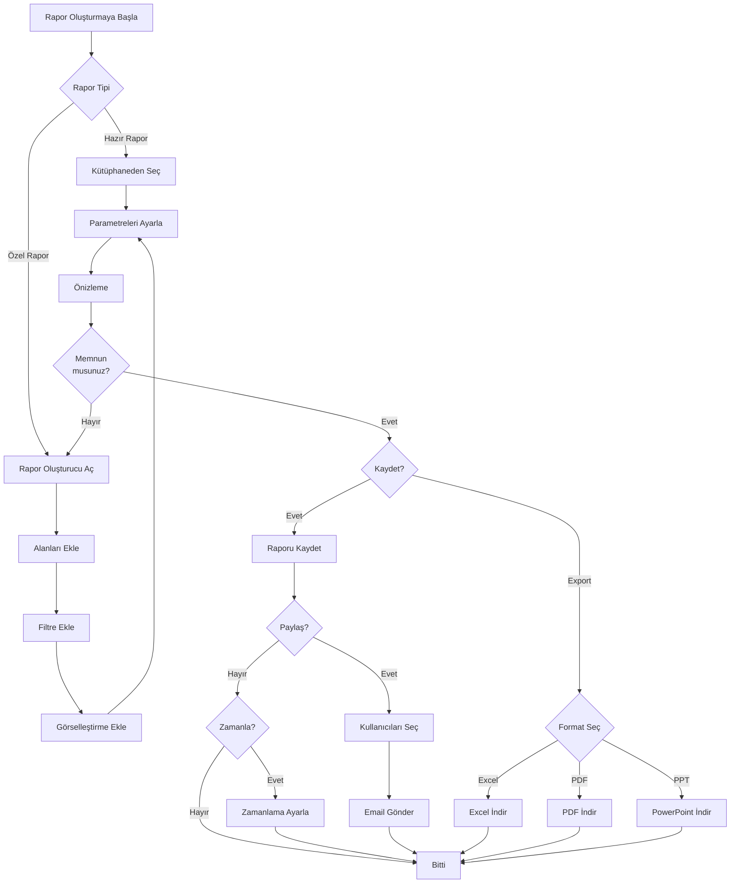

# 📋 PO-07: RAPORLAMA VE DASHBOARD SİSTEMİ

## 🎯 Executive Summary

### Modül Amacı
Tüm paydaşlar için özelleştirilmiş dashboard'lar, gerçek zamanlı raporlar, veri analitiği ve karar destek sistemleri sunmak.

### Temel Özellikler
- ✅ **Role-Based Dashboards**: Her rol için özel görünüm
- ✅ **Gerçek Zamanlı KPI'lar**: Anlık metrikler ve göstergeler
- ✅ **Dinamik Rapor Oluşturucu**: Drag-drop ile özel raporlar
- ✅ **İnteraktif Grafikler**: Drill-down ve filtreleme
- ✅ **Otomatik Raporlama**: Planlanmış raporlar ve e-posta gönderimi
- ✅ **Export Özellikleri**: Excel, PDF, PowerPoint
- ✅ **BI Entegrasyonu**: Power BI, Tableau desteği

### İş Değeri
- **%80 Rapor Hazırlama Süresinden Tasarruf**: Otomatik raporlar
- **%100 Veri Güncelliği**: Gerçek zamanlı dashboard'lar
- **%60 Karar Alma Hızında Artış**: Anında içgörüler
- **%90 Veri Doğruluğu**: Tek kaynak, tutarlı metrikler

---

## 👥 User Personas

### Persona 1: GMY (Karar Verici)

**Hedefler:**
- Stratejik kararlar için makro görünüm
- Bakanlığa sunmak için hazır raporlar
- Trend analizleri ve tahminler

**Success Criteria:**
- 1 tıkla özet rapor alabilmeli
- Mobil cihazdan erişebilmeli
- PowerPoint export edebilmeli

---

### Persona 2: İl Müdürü (Operasyonel Yönetici)

**Hedefler:**
- İlinin performansını izlemek
- Ekip verimliliğini ölçmek
- Bütçe takibi yapmak

**Success Criteria:**
- İl bazlı dashboard
- Ekip performans raporları
- Günlük özet e-posta

---

### Persona 3: Merkez Analisti (Veri Analisti)

**Hedefler:**
- Detaylı analizler yapmak
- Özel raporlar oluşturmak
- İstatistiksel modeller kurmak

**Success Criteria:**
- Ham veriye erişim
- SQL query yazabilme
- Power BI entegrasyonu

---

## 📖 User Stories

### Epic 1: Dashboard'lar

#### US-701: Genel Müdür Yardımcısı Dashboard

**As a** GMY
**I want** ulusal düzeyde özet görmek
**So that** stratejik kararları hızlı alabilirim

**Acceptance Criteria:**
- ✅ KPI Kartları: Toplam Başvuru, Onay Oranı, Bütçe Kullanımı, Ortalama Süre
- ✅ Türkiye Haritası: İl bazlı bütçe dağılımı heat map
- ✅ Zaman Serisi: Son 12 ay başvuru trendi
- ✅ Sektör Dağılımı: Pasta grafik
- ✅ Risk Uyarıları: Kritik durumlar widget'ı
- ✅ Mobil responsive: Tablet/telefonda da çalışır

**Story Points:** 13
**Priority:** CRITICAL
**Sprint:** 22

---

#### US-702: İl Müdürü Dashboard

**As an** İl Müdürü
**I want** ilimin performansını görmek
**So that** ekibimi yönetebilirim

**Acceptance Criteria:**
- ✅ İl KPI'ları: Başvuru, Onay oranı, SLA uyumu, Bütçe
- ✅ Ekip Performansı: Uzman bazlı iş yükü ve tamamlama hızı
- ✅ Günlük İstatistik: Bugün neler oldu?
- ✅ Bekleyen İşler: Onay bekleyen, SLA riskli dosyalar
- ✅ Karşılaştırma: İlimiz vs Türkiye ortalaması
- ✅ Filtreleme: Tarih aralığı seçimi

**Story Points:** 13
**Priority:** HIGH
**Sprint:** 22

---

#### US-703: Vatandaş Dashboard (Başvuran)

**As a** Başvuran
**I want** başvurumun durumunu görmek
**So that** süreç hakkında bilgi sahibi olabilirim

**Acceptance Criteria:**
- ✅ Başvuru Timeline: Hangi aşamada, ne zaman?
- ✅ İlerleme Çubuğu: %kaç tamamlandı
- ✅ Bildirimler: Yeni gelişmeler
- ✅ Dokuman Durumu: Hangi dökümanlar onaylandı/reddedildi
- ✅ Hakediş Takibi: Ödeme durumu
- ✅ Mesaj Kutusu: Sistem mesajları

**Story Points:** 8
**Priority:** HIGH
**Sprint:** 23

---

### Epic 2: Raporlama

#### US-704: Dinamik Rapor Oluşturucu

**As a** Merkez Analisti
**I want** özel rapor oluşturmak
**So that** spesifik analizler yapabileyim

**Acceptance Criteria:**
- ✅ Drag-Drop Interface: Alanları sürükle-bırak ile ekle
- ✅ Veri Kaynakları: Başvurular, Ödemeler, Kullanıcılar vb.
- ✅ Filtreler: Tarih, İl, Sektör, Durum vb.
- ✅ Görselleştirme: Tablo, bar chart, line chart, pie chart
- ✅ Kaydet ve Paylaş: Raporu kaydet, başkalarıyla paylaş
- ✅ Schedule: Otomatik günlük/haftalık gönderim

**Story Points:** 21
**Priority:** HIGH
**Sprint:** 23-24

---

#### US-705: Hazır Raporlar Kütüphanesi

**As a** GMY
**I want** hazır raporlara erişmek
**So that** hemen kullanabileyim

**Acceptance Criteria:**
- ✅ Rapor kategorileri: Operasyonel, Finansal, Performans, Risk
- ✅ Hazır raporlar: "Aylık Özet", "Bütçe Kullanım", "İl Performansları", "Risk Analizi"
- ✅ Parametreler: Tarih aralığı, İl seçimi
- ✅ Otomatik güncelleme: Rapor her açılışta güncel veri çeker
- ✅ Export: Excel, PDF, PPT
- ✅ Favori: Sık kullanılan raporları favoriye ekleme

**Story Points:** 13
**Priority:** HIGH
**Sprint:** 24

---

#### US-706: Zamanlanmış Raporlar

**As an** İl Müdürü
**I want** otomatik günlük rapor almak
**So that** manuel rapor çekmek zorunda kalmayayım

**Acceptance Criteria:**
- ✅ Zamanlama: Günlük, Haftalık, Aylık, Özel (cron)
- ✅ Alıcılar: Email adresleri listesi
- ✅ Format: PDF veya Excel
- ✅ İçerik: Hangi raporlar gönderilsin
- ✅ Koşullu gönderim: "Sadece yeni veri varsa gönder"
- ✅ Log: Gönderim geçmişi

**Story Points:** 13
**Priority:** MEDIUM
**Sprint:** 25

---

### Epic 3: Analitik ve İçgörüler

#### US-707: Trend Analizi ve Tahminleme

**As a** Merkez Analisti
**I want** gelecek tahminleri görmek
**So that** proaktif kararlar alabilirim

**Acceptance Criteria:**
- ✅ Başvuru trendi: Gelecek 3 ay tahmini
- ✅ Bütçe tükenme tahmini: "X gün sonra bütçe tükenir"
- ✅ Sektör trendi: Hangi sektör yükseliyor/düşüyor
- ✅ İl performans tahmini: Hangi il hedefini tutturacak
- ✅ Makine öğrenmesi: Geçmiş verilerle model
- ✅ Güven aralığı: Tahmin doğruluk oranı

**Story Points:** 21
**Priority:** MEDIUM
**Sprint:** 25-26

---

#### US-708: Karşılaştırmalı Analiz

**As a** GMY
**I want** illeri karşılaştırmak
**So that** en iyi/kötü performansı görebileyim

**Acceptance Criteria:**
- ✅ İl sıralaması: Performans metriğine göre sıralama
- ✅ Benchmark: Her ilin Türkiye ortalamasına göre skoru
- ✅ Radar chart: Çok boyutlu karşılaştırma
- ✅ Zaman serisi: İllerin zaman içinde gelişimi
- ✅ Filtreleme: Belirli illeri seç ve karşılaştır
- ✅ Export: Karşılaştırma raporunu indir

**Story Points:** 13
**Priority:** MEDIUM
**Sprint:** 26

---

## 🔄 İş Akışları (Workflows)

### Workflow 1: Rapor Oluşturma ve Paylaşma



---

## 📊 Dashboard Mockups

### GMY Dashboard Örnek

```
┌──────────────────────────────────────────────────────────────┐
│  📊 GENEL MÜDÜR YARDIMCISI DASHBOARD                         │
├──────────────────────────────────────────────────────────────┤
│                                                              │
│  ┌──────┬──────┬──────┬──────┐                              │
│  │25,432│ %87  │485M₺ │4.2gün│                              │
│  │Başvuru│Onay │Bütçe│Ort.Süre│                             │
│  └──────┴──────┴──────┴──────┘                              │
│                                                              │
│  🗺️ TÜRKİYE HARİTASI          📈 BAŞVURU TRENDİ            │
│  [Heat Map - Bütçe Dağılımı]  [Line Chart - 12 Ay]          │
│                                                              │
│  🥧 SEKTÖR DAĞILIMI            ⚠️ RİSK UYARILARI             │
│  [Pie Chart]                   • 3 Yüksek Risk Başvuru      │
│                                • 2 İl SLA Sınırında          │
│                                • Bütçe %95 Doldu             │
└──────────────────────────────────────────────────────────────┘
```

---

## 📊 Success Metrics

| Metrik | Hedef | Ölçüm Yöntemi |
|--------|-------|---------------|
| **Dashboard Kullanım** | %90+ günlük aktif kullanıcı | Login / Toplam kullanıcı |
| **Rapor Oluşturma Süresi** | < 5 dakika | Başla - Bitir timestamp |
| **Otomatik Rapor Kullanımı** | > %70 | Scheduled / Manual |
| **Export Kullanımı** | > %50 raporlar export edilir | Export / Toplam rapor |
| **Dashboard Yükleme Süresi** | < 2 saniye | Page load time |
| **Veri Doğruluğu** | %99.9 | Validation hatası / Toplam |

---

**Hazırlayan**: Product Owner
**Son Güncelleme**: 09.10.2025
**Versiyon**: 1.0.0
