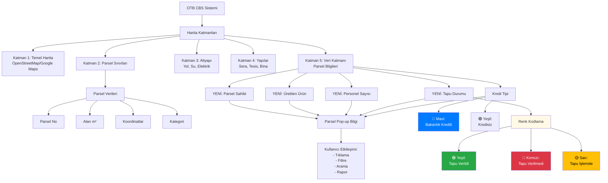
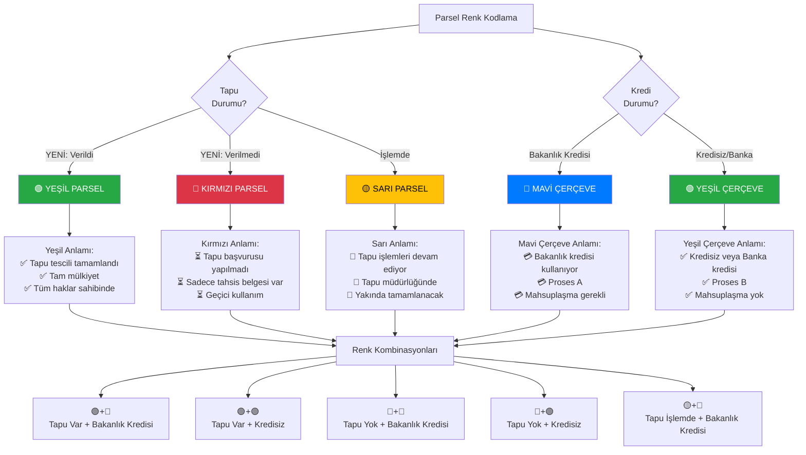
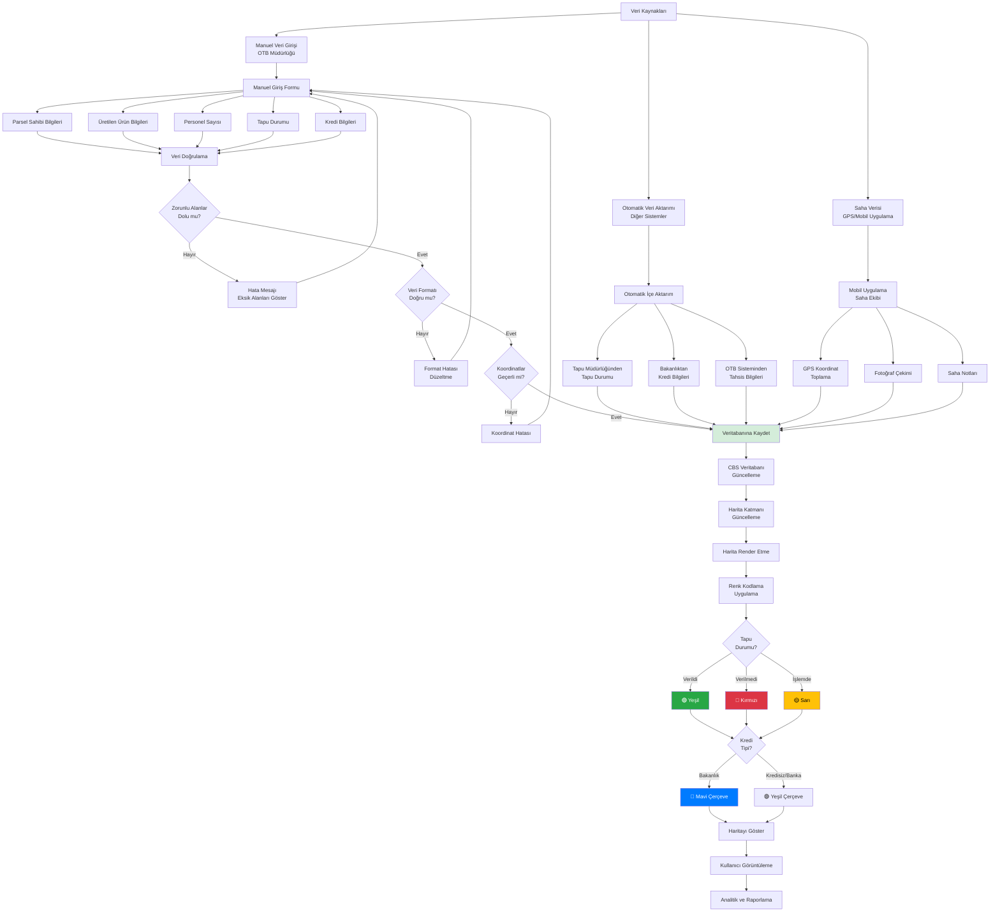
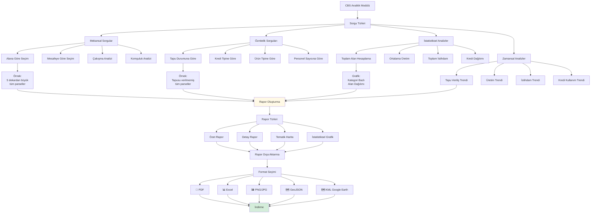

# MyFirstGame
 Baby steps with Unity

# OTB COĞRAFİ BİLGİ SİSTEMİ (CBS) VE VERİ YÖNETİMİ DOKÜMANI

## 📋 GENEL BAKIŞ

Bu doküman, OTB (Organize Tarım Bölgeleri) projelerinde **Coğrafi Bilgi Sistemi (CBS)** kullanımı ve **Veri Yönetimi** süreçlerini detaylı olarak açıklamaktadır. 23.09.2025 toplantı notları ve proje gereksinimleri temel alınarak hazırlanmıştır.

---

## 🎯 CBS (COĞRAFİ BİLGİ SİSTEMİ) NEDİR?

**CBS (Coğrafi Bilgi Sistemi / Geographic Information System - GIS)**, coğrafi verilerin toplanması, depolanması, analiz edilmesi ve görselleştirilmesi için kullanılan bir sistemdir. OTB projelerinde parseller, altyapı, üretim ve yönetim bilgilerinin harita üzerinde gösterilmesi ve takibi için kullanılır.

### 23.09.2025 Toplantı Notlarından CBS Gereksinimleri:

- **YENİ:** Coğrafya Bilgi Sistemi Haritalar Bize Özel mi olacak?
  → Evet, OTB'ye özel CBS harita sistemi gerekli

- **YENİ:** Tapusu verildi verilmedi ayrımı parselizasyonda renk ayrımı
  → 🟢 Yeşil: Tapu verildi
  → 🔴 Kırmızı: Tapu verilmedi

- **YENİ:** OTB'den İstenilen Bilgiler:
  → Parsel Sahibi
  → Üretilen Ürün
  → Personel Sayısı

---

## 📊 1. CBS HARITA SİSTEMİ GENEL YAPISI



---

## 📊 2. PARSEL CBS VERİ YAPISI

```mermaid
graph TD
    Start[Parsel CBS Verisi] --> GeoData[Coğrafi Veri]
    Start --> AttrData[Öznitelik Verisi]

    GeoData --> Geometry[Geometri Tipi:<br/>Polygon]
    Geometry --> Coordinates[Koordinatlar<br/>WGS84 / EPSG:4326]
    Coordinates --> Points[Nokta Listesi:<br/>Köşe Koordinatları]

    Points --> Point1[Köşe 1: Lat, Lon]
    Points --> Point2[Köşe 2: Lat, Lon]
    Points --> Point3[Köşe 3: Lat, Lon]
    Points --> Point4[Köşe 4: Lat, Lon]
    Points --> PointN[...]

    AttrData --> BasicInfo[Temel Bilgiler]
    AttrData --> OwnerInfo[Sahiplik Bilgileri]
    AttrData --> ProductionInfo[Üretim Bilgileri]
    AttrData --> LegalInfo[Yasal Bilgiler]
    AttrData --> FinancialInfo[Finansal Bilgiler]

    BasicInfo --> BI1[Parsel No]
    BasicInfo --> BI2[Ada No]
    BasicInfo --> BI3[Parsel Alanı m²]
    BasicInfo --> BI4[Parsel Alanı Dekar]
    BasicInfo --> BI5[Kategori]

    BI5 --> Cat1[Hayvansal Üretim]
    BI5 --> Cat2[Bitkisel Üretim]
    BI5 --> Cat3[Su Ürünleri]
    BI5 --> Cat4[Sanayi]

    OwnerInfo --> OI1[YENİ: Parsel Sahibi Ad Soyad]
    OwnerInfo --> OI2[TC/Vergi No]
    OwnerInfo --> OI3[İletişim Bilgileri]
    OwnerInfo --> OI4[Tahsis Tarihi]

    ProductionInfo --> PI1[YENİ: Üretilen Ürün]
    ProductionInfo --> PI2[Üretim Kapasitesi]
    ProductionInfo --> PI3[Üretim Miktarı]
    ProductionInfo --> PI4[YENİ: Personel Sayısı]
    ProductionInfo --> PI5[Kadın Personel]
    ProductionInfo --> PI6[Erkek Personel]

    LegalInfo --> LI1[YENİ: Tapu Durumu]
    LegalInfo --> LI2[Tapu Tarihi]
    LegalInfo --> LI3[Tahsis Belgesi No]

    LI1 --> Deed1[🟢 Tapu Verildi]
    LI1 --> Deed2[🔴 Tapu Verilmedi]
    LI1 --> Deed3[🟡 Tapu İşlemde]

    FinancialInfo --> FI1[Kredi Tipi]
    FinancialInfo --> FI2[Kredi Tutarı]
    FinancialInfo --> FI3[Borç Durumu]
    FinancialInfo --> FI4[Ödeme Planı]

    FI1 --> Credit1[🔵 Bakanlık Kredisi - Proses A]
    FI1 --> Credit2[🟢 Kredisiz/Banka - Proses B]

    style Deed1 fill:#28a745,color:#fff
    style Deed2 fill:#dc3545,color:#fff
    style Deed3 fill:#ffc107,color:#000
    style Credit1 fill:#007bff,color:#fff
    style Credit2 fill:#28a745,color:#fff
```



---

## 📊 3. CBS RENK KODLAMA SİSTEMİ



---

## 📊 4. PARSEL POP-UP BİLGİ EKRANI

Kullanıcı harita üzerinde bir parsele tıkladığında açılan bilgi penceresi:

```
┌─────────────────────────────────────────────────────────────────┐
│                  PARSEL BİLGİ DETAYLARI                         │
│                   Parsel No: 12345                               │
└─────────────────────────────────────────────────────────────────┘

📍 KONUM BİLGİLERİ
─────────────────────────────────────────────────────────────────
Ada No                 : 101
Parsel No              : 12345
Alan (m²)              : 50,000 m²
Alan (Dekar)           : 5 dekar
Enlem (Latitude)       : 39.1234
Boylam (Longitude)     : 27.5678
Kategori               : 🌾 Bitkisel Üretim

👤 SAHİPLİK BİLGİLERİ (YENİ)
─────────────────────────────────────────────────────────────────
Parsel Sahibi          : [Ad Soyad / Şirket Adı]
TC/Vergi No            : [**********]
Telefon                : [0555 XXX XX XX]
E-posta                : [email@example.com]
Tahsis Tarihi          : [01/06/2024]

🏭 ÜRETİM BİLGİLERİ (YENİ)
─────────────────────────────────────────────────────────────────
Üretilen Ürün          : Domates (Sera)
Üretim Kapasitesi      : 225 ton/yıl (45 ton/dekar)
Mevcut Üretim          : 180 ton (Bu yıl)
Üretim Başlangıcı      : Ocak 2024

👥 PERSONEL BİLGİLERİ (YENİ)
─────────────────────────────────────────────────────────────────
Toplam Personel        : 38 kişi
   ↳ Kadın             : 29 kişi (%76)
   ↳ Erkek             : 9 kişi (%24)
Mevsimlik Personel     : 15 kişi
Sürekli Personel       : 23 kişi

📋 YASAL DURUM
─────────────────────────────────────────────────────────────────
Tapu Durumu            : 🟢 Tapu Verildi
Tapu Tarihi            : 15/08/2024
Tapu No                : 12345/2024
Tahsis Belgesi No      : OTB-2024-12345

💳 FİNANSAL BİLGİLER
─────────────────────────────────────────────────────────────────
Kredi Tipi             : 🔵 Bakanlık Kredisi (Proses A)
Kredi Tutarı           : 2,500,000 TL
Kullanılan Kredi       : 2,500,000 TL
Kalan Borç             : 1,850,000 TL
Ödeme Durumu           : ✅ Düzenli
Sonraki Ödeme          : Aralık 2024 (Yıl Sonu)

📊 YATIRIM BİLGİLERİ
─────────────────────────────────────────────────────────────────
Toplam Yatırım         : 3,200,000 TL
Tamamlanma Oranı       : %100
Yatırım Tarihi         : Mart 2023 - Aralık 2023
Sera Tipi              : Jeotermal Isıtmalı Cam Sera
Sera Alanı             : 4,500 m²

🌍 YEŞİL OTB BİLGİLERİ
─────────────────────────────────────────────────────────────────
Enerji Kaynağı         : ♨️ Jeotermal
Enerji Tasarrufu       : %82
Su Tasarrufu           : %65 (Damla sulama)
Karbon Ayak İzi        : -45 ton CO2/yıl (Negatif)

📅 ÖNEM TARİHLERİ
─────────────────────────────────────────────────────────────────
Tahsis Tarihi          : 01/06/2024
Tapu Tarihi            : 15/08/2024
Üretim Başlangıcı      : 20/01/2024
İlk İhracat            : 15/03/2024

🔗 HIZLI ERİŞİM
─────────────────────────────────────────────────────────────────
☐ Parsel Detay Sayfası
☐ Üretim Raporları
☐ Finansal Raporlar
☐ Belge Arşivi
☐ İletişim Bilgileri

[KAPAT]  [DETAYLI RAPOR]  [YAZDIR]
```

---

## 📊 5. CBS VERİ GİRİŞİ VE GÜNCELLEME AKIŞI



---

## 📊 6. CBS ANALİTİK VE RAPORLAMA



---

## 📊 7. CBS KULLANICI ARAYÜZLERİ

### 7.1. Harita Görünümleri

```
┌─────────────────────────────────────────────────────────────────┐
│  OTB CBS - Harita Görünümü                      [⚙️ Ayarlar]     │
├─────────────────────────────────────────────────────────────────┤
│                                                                   │
│  [🗺️ Harita] [📊 Tablo] [📈 Analitik]                          │
│                                                                   │
│  ┌─────────────────┐ ┌───────────────────────────────────────┐  │
│  │ Filtreler       │ │                                       │  │
│  ├─────────────────┤ │                                       │  │
│  │ 📍 Kategori     │ │                                       │  │
│  │ ☐ Hayvansal     │ │         [HARITA ALANI]                │  │
│  │ ☑ Bitkisel      │ │                                       │  │
│  │ ☐ Su Ürünleri   │ │      Renk Kodlu Parseller             │  │
│  │ ☐ Sanayi        │ │                                       │  │
│  │                 │ │                                       │  │
│  │ 📋 Tapu Durumu  │ │                                       │  │
│  │ ☑ Tapu Var      │ │                                       │  │
│  │ ☑ Tapu Yok      │ │                                       │  │
│  │ ☑ İşlemde       │ │                                       │  │
│  │                 │ │                                       │  │
│  │ 💳 Kredi Tipi   │ │                                       │  │
│  │ ☑ Bakanlık      │ │                                       │  │
│  │ ☑ Kredisiz      │ │                                       │  │
│  │                 │ │                                       │  │
│  │ [Filtreyi      │ │                                       │  │
│  │  Uygula]        │ │                                       │  │
│  └─────────────────┘ └───────────────────────────────────────┘  │
│                                                                   │
│  ┌───────────────────────────────────────────────────────────┐  │
│  │ Renk Açıklamaları:                                        │  │
│  │ 🟢 Tapu Verildi  🔴 Tapu Verilmedi  🟡 Tapu İşlemde      │  │
│  │ 🔵 Bakanlık Kredisi (Çerçeve)  🟢 Kredisiz (Çerçeve)     │  │
│  └───────────────────────────────────────────────────────────┘  │
│                                                                   │
│  📊 Özet İstatistikler:                                          │
│  Toplam Parsel: 245  |  Tapu Var: 180  |  Toplam İstihdam: 4250│
└─────────────────────────────────────────────────────────────────┘
```

### 7.2. Tablo Görünümü

```
┌─────────────────────────────────────────────────────────────────┐
│  OTB CBS - Tablo Görünümü                                        │
├─────────────────────────────────────────────────────────────────┤
│  [Ara: ________]  [🔍]  [Dışa Aktar ▼]  [Sütun Seçimi ▼]       │
├──────┬────────────────┬─────────┬──────────┬─────────┬──────────┤
│Parsel│ Parsel Sahibi  │ Kategori│ Üretilen │ Personel│  Tapu    │
│  No  │    (YENİ)      │         │   Ürün   │  Sayısı │ Durumu   │
│      │                │         │  (YENİ)  │ (YENİ)  │  (YENİ)  │
├──────┼────────────────┼─────────┼──────────┼─────────┼──────────┤
│12345 │ Ali Yılmaz     │ Bitkisel│ Domates  │   38    │ 🟢 Var   │
│12346 │ Veli Tarım A.Ş│ Bitkisel│ Salatalık│   45    │ 🟢 Var   │
│12347 │ Ayşe Demir     │ Hayvansal│ Süt      │   12    │ 🔴 Yok   │
│12348 │ Mehmet Kaya    │ Bitkisel│ Domates  │   28    │ 🟡 İşlemde│
│12349 │ Tarım Koop.    │ Su Ürün.│ Balık    │   22    │ 🟢 Var   │
├──────┴────────────────┴─────────┴──────────┴─────────┴──────────┤
│ Toplam: 245 parsel  |  Sayfa: 1/49  |  [< Önceki] [Sonraki >]  │
└─────────────────────────────────────────────────────────────────┘
```

---

## 📊 8. CBS VERİ GİRİŞ FORMU

### OTB Müdürlüğü Veri Giriş Ekranı (YENİ)

```
┌─────────────────────────────────────────────────────────────────┐
│         CBS PARSEL VERİ GİRİŞ/GÜNCELLEME FORMU                  │
│              (OTB Müdürlüğü Kullanımı İçin)                     │
└─────────────────────────────────────────────────────────────────┘

📍 PARSEL SEÇİMİ
─────────────────────────────────────────────────────────────────
Parsel No               : [12345] [🔍 Parsel Ara]
veya
Haritadan Seç           : [🗺️ Haritayı Aç]

════════════════════════════════════════════════════════════════

👤 PARSEL SAHİBİ BİLGİLERİ (YENİ - Zorunlu)
─────────────────────────────────────────────────────────────────
☐ Gerçek Kişi   ☑ Tüzel Kişi

Ad Soyad/Unvan          : [Ali Yılmaz Tarım A.Ş._______________]
TC/Vergi No             : [1234567890_________________________]
Telefon                 : [0555 123 45 67____________________]
E-posta                 : [ali@tarim.com______________________]
Adres                   : [____________________________________]
Tahsis Tarihi           : [01/06/2024] 📅

════════════════════════════════════════════════════════════════

🏭 ÜRETİM BİLGİLERİ (YENİ - Zorunlu)
─────────────────────────────────────────────────────────────────
Üretilen Ürün           : [Domates (Sera)_____________________] *

Kategori                : ☐ Hayvansal  ☑ Bitkisel  ☐ Su Ürünleri

Üretim Kapasitesi       : [225] ton/yıl
Mevcut Üretim (Bu Yıl)  : [180] ton
Üretim Başlangıç Tarihi : [20/01/2024] 📅

Tesis Tipi              : [Jeotermal Sera____________________]
Tesis Alanı (m²)        : [4,500] m²

════════════════════════════════════════════════════════════════

👥 PERSONEL BİLGİLERİ (YENİ - Zorunlu)
─────────────────────────────────────────────────────────────────
Toplam Personel Sayısı  : [38] kişi *
   ↳ Kadın Personel     : [29] kişi
   ↳ Erkek Personel     : [9] kişi

Mevsimlik Personel      : [15] kişi
Sürekli Personel        : [23] kişi

════════════════════════════════════════════════════════════════

📋 TAPU DURUMU (YENİ - Zorunlu)
─────────────────────────────────────────────────────────────────
Tapu Durumu             : ☑ Tapu Verildi
                          ☐ Tapu Verilmedi
                          ☐ Tapu İşlemde

Tapu Tarihi             : [15/08/2024] 📅
Tapu No                 : [12345/2024_________________________]
Tahsis Belgesi No       : [OTB-2024-12345____________________]

CBS Renk Kodu           : 🟢 Yeşil (Otomatik)

════════════════════════════════════════════════════════════════

💳 KREDİ BİLGİLERİ
─────────────────────────────────────────────────────────────────
Kredi Kullanıyor mu?    : ☑ Evet  ☐ Hayır

Kredi Tipi              : ☑ Bakanlık Kredisi (Proses A)
                          ☐ Kredisiz/Banka Kredisi (Proses B)

Kredi Tutarı            : [2,500,000] TL
Kullanılan Kredi        : [2,500,000] TL
Kalan Borç              : [1,850,000] TL
Ödeme Durumu            : ☑ Düzenli  ☐ Gecikme  ☐ Takipte

CBS Renk Kodu (Çerçeve) : 🔵 Mavi (Otomatik)

════════════════════════════════════════════════════════════════

📊 YATIRIM BİLGİLERİ
─────────────────────────────────────────────────────────────────
Toplam Yatırım          : [3,200,000] TL
Tamamlanma Oranı        : [%100] ████████████ 100%
Yatırım Başlangıç       : [01/03/2023] 📅
Yatırım Bitiş           : [31/12/2023] 📅

════════════════════════════════════════════════════════════════

🌍 YEŞİL OTB BİLGİLERİ (Opsiyonel)
─────────────────────────────────────────────────────────────────
Enerji Kaynağı          : ☐ Jeotermal  ☐ GES  ☐ RES  ☐ Biokütle
Enerji Tasarrufu        : [%82] ████████-- 82%
Su Tasarrufu            : [%65] ██████---- 65%
Karbon Ayak İzi         : [-45] ton CO2/yıl

════════════════════════════════════════════════════════════════

📎 EKLER
─────────────────────────────────────────────────────────────────
Fotoğraflar             : [📷 3 Fotoğraf Yüklendi]
Belgeler                : [📄 5 Belge Yüklendi]
Diğer                   : [📎 Dosya Yükle]

════════════════════════════════════════════════════════════════

[❌ İptal]  [💾 Kaydet]  [💾 Kaydet ve CBS'yi Güncelle]
```

---

## 📊 9. CBS PERFORMANS VE TEKNİK ÖZELLİKLER

### 9.1. Teknik Altyapı

```mermaid
graph TD
    Start[CBS Teknik Altyapı] --> Frontend[Ön Yüz]
    Start --> Backend[Arka Yüz]
    Start --> Database[Veritabanı]
    Start --> MapServer[Harita Sunucusu]

    Frontend --> FE1[Web Tarayıcı]
    FE1 --> FE2[Harita Kütüphanesi:<br/>Leaflet / OpenLayers]
    FE2 --> FE3[JavaScript Framework:<br/>React / Vue.js]

    Backend --> BE1[API Sunucusu]
    BE1 --> BE2[Node.js / Python]
    BE2 --> BE3[RESTful API]
    BE3 --> BE4[Authentication<br/>Authorization]

    Database --> DB1[İlişkisel DB:<br/>PostgreSQL]
    DB1 --> DB2[PostGIS Uzantısı<br/>Coğrafi Veri Desteği]
    DB2 --> DB3[Geometri Tipler i:<br/>Point, LineString,<br/>Polygon]

    MapServer --> MS1[GeoServer]
    MS1 --> MS2[WMS (Web Map Service)]
    MS1 --> MS3[WFS (Web Feature Service)]
    MS1 --> MS4[WCS (Web Coverage Service)]

    FE2 --> Request[Harita Talebi]
    Request --> MS2
    MS2 --> Render[Harita Render]
    Render --> Response[Harita Görüntüsü]
    Response --> FE1

    BE3 --> DataRequest[Veri Talebi]
    DataRequest --> DB2
    DB2 --> DataResponse[Veri Yanıtı]
    DataResponse --> BE3
    BE3 --> FE3

    style DB2 fill:#fff9e6
    style MS2 fill:#e6ffe6
```

### 9.2. Veri Modeli

**Parsel Tablosu (parcels)**

| Alan Adı | Veri Tipi | Açıklama |
|---|---|---|
| id | SERIAL PRIMARY KEY | Otomatik artan ID |
| parcel_no | VARCHAR(50) UNIQUE | Parsel numarası |
| ada_no | VARCHAR(50) | Ada numarası |
| geometry | GEOMETRY(Polygon, 4326) | Parsel sınırı (WGS84) |
| area_sqm | DECIMAL(12,2) | Alan (m²) |
| area_dekar | DECIMAL(10,2) | Alan (dekar) |
| category | VARCHAR(50) | Kategori (Hayvansal/Bitkisel/Su Ürünleri) |
| owner_name | VARCHAR(200) | **YENİ:** Parsel sahibi |
| owner_tc_tax | VARCHAR(20) | **YENİ:** TC/Vergi No |
| owner_phone | VARCHAR(20) | **YENİ:** Telefon |
| owner_email | VARCHAR(100) | **YENİ:** E-posta |
| product_name | VARCHAR(200) | **YENİ:** Üretilen ürün |
| production_capacity | DECIMAL(10,2) | Üretim kapasitesi (ton/yıl) |
| personnel_total | INTEGER | **YENİ:** Toplam personel sayısı |
| personnel_female | INTEGER | **YENİ:** Kadın personel |
| personnel_male | INTEGER | **YENİ:** Erkek personel |
| deed_status | VARCHAR(20) | **YENİ:** Tapu durumu (given/not_given/processing) |
| deed_date | DATE | Tapu tarihi |
| deed_no | VARCHAR(50) | Tapu numarası |
| credit_type | VARCHAR(20) | Kredi tipi (ministry/none_bank) |
| credit_amount | DECIMAL(12,2) | Kredi tutarı |
| debt_amount | DECIMAL(12,2) | Kalan borç |
| created_at | TIMESTAMP | Oluşturulma tarihi |
| updated_at | TIMESTAMP | Güncellenme tarihi |
| created_by | INTEGER | Oluşturan kullanıcı ID |
| updated_by | INTEGER | Güncelleyen kullanıcı ID |

---

## 🎯 ÖNEMLİ NOKTALAR VE YENİ GEREK SİNİMLER

### ✅ CBS Kritik Noktaları (23.09.2025 Toplantı Notları):

1. **Özel CBS Harita Sistemi (YENİ):**
   - ✨ Coğrafya Bilgi Sistemi Haritalar Bize Özel mi olacak? → EVET
   - OTB'ye özel tasarlanmış harita sistemi
   - Özel renk kodlama sistemi
   - Özel veri katmanları

2. **Parsel Sahibi Bilgisi (YENİ - Zorunlu):**
   - ✨ Parsel Sahibi bilgisi mutlaka olmalı
   - Ad Soyad / Şirket Ünvanı
   - TC/Vergi No
   - İletişim bilgileri
   - Tahsis tarihi

3. **Üretilen Ürün Bilgisi (YENİ - Zorunlu):**
   - ✨ Üretilen Ürün bilgisi mutlaka olmalı
   - Ürün adı ve türü
   - Üretim kapasitesi
   - Mevcut üretim miktarı

4. **Personel Sayısı (YENİ - Zorunlu):**
   - ✨ Personel Sayısı bilgisi mutlaka olmalı
   - Toplam personel
   - Kadın/Erkek ayrımı
   - Mevsimlik/Sürekli ayrımı

5. **Tapu Durumu Renk Kodlaması (YENİ - Kritik):**
   - ✨ Tapusu verildi verilmedi ayrımı parselizasyonda renk ayrımı
   - 🟢 **Yeşil:** Tapu verildi
   - 🔴 **Kırmızı:** Tapu verilmedi
   - 🟡 **Sarı:** Tapu işlemde (Opsiyonel)

6. **Kredi Tipi Gösterimi:**
   - 🔵 **Mavi Çerçeve:** Bakanlık kredisi kullananlar (Proses A)
   - 🟢 **Yeşil Çerçeve:** Kredisiz/Banka kredisi (Proses B)

7. **OTB Müdürlüğü Veri Giriş Sorumluluğu:**
   - OTB Müdürlüğü tüm verileri sisteme girmekle sorumlu
   - Manuel veri girişi ara yüzü gerekli
   - Veri doğrulama mekanizmaları

---

## 📊 SÜREÇ ÖZETİ

### **CBS Veri Akış Özeti:**

```
Veri Kaynakları
    ↓
YENİ: OTB Müdürlüğü Veri Girişi:
  - YENİ: Parsel Sahibi Bilgileri
  - YENİ: Üretilen Ürün Bilgileri
  - YENİ: Personel Sayısı
  - YENİ: Tapu Durumu
  - Kredi Bilgileri
    ↓
Veri Doğrulama ve Kontrol
    ↓
CBS Veritabanına Kaydetme
    ↓
Harita Katmanı Güncelleme
    ↓
YENİ: Renk Kodlama Uygulama:
  🟢 Yeşil: Tapu Verildi
  🔴 Kırmızı: Tapu Verilmedi
  🟡 Sarı: Tapu İşlemde
  🔵 Mavi Çerçeve: Bakanlık Kredisi
  🟢 Yeşil Çerçeve: Kredisiz
    ↓
Haritayı Kullanıcıya Gösterme
    ↓
Kullanıcı Etkileşimi:
  - Parsel Tıklama → Detay Bilgi
  - Filtre Uygulama
  - Arama
  - Raporlama
    ↓
Analitik ve Raporlar:
  - Tapu Durumu Raporları
  - Üretim Raporları
  - İstihdam Raporları
  - Kredi Raporları
```

---

## 🎯 SONUÇ

Bu doküman, **CBS (Coğrafi Bilgi Sistemi)** ve **Veri Yönetimi** süreçlerini 23.09.2025 toplantı notlarındaki güncellemeler ışığında detaylı olarak açıklamaktadır:

- ✅ **Özel CBS Sistemi:** OTB'ye özel harita ve renk kodlama sistemi
- ✅ **Parsel Sahibi Bilgisi:** Zorunlu veri alanı, detaylı sahibiyet takibi
- ✅ **Üretilen Ürün Bilgisi:** Üretim türü ve miktarı takibi
- ✅ **Personel Sayısı:** İstihdam takibi (Kadın/Erkek ayrımı ile)
- ✅ **Tapu Durumu Renk Kodlama:** Görsel tapu durumu takibi (Yeşil/Kırmızı/Sarı)
- ✅ **Kredi Tipi Gösterimi:** Kredi türü çerçeve rengi ile (Mavi/Yeşil)
- ✅ **OTB Müdürlüğü Veri Girişi:** Manuel veri giriş sistemi ve sorumluluklar
- ✅ **Analitik ve Raporlama:** Kapsamlı analiz ve raporlama yetenekleri

---

**📅 Son Güncelleme:** 23.09.2025 Toplantı Notları Temel Alınarak Hazırlanmıştır.
